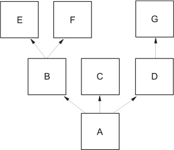

Classes and object-oriented programming 
===================================================


### *This lab covers*

-   [Defining classes]
-   [Using instance variables and [\@property]]
-   [Defining methods]
-   [Defining class variables and methods]
-   [Inheriting from other classes]
-   [Making variables and methods private]
-   [Inheriting from multiple classes]


In this lab, I discuss Python classes, which can be used to hold
both data and code. Although most programmers are probably familiar with
classes or objects in other languages, I make no particular assumptions
about knowledge of a specific language or paradigm. In addition, this
chapter is a description only of the constructs available in Python;
it's not an exposition on object-oriented programming (OOP) itself.


### Defining classes


A
*class* in Python is effectively a data type. All the data types built
into Python are classes, and Python gives you powerful tools to
manipulate every aspect of a class's behavior. You define a class with
the [class] statement:


```
class MyClass:
    body
```


[body] is a list of Python statements---typically, variable
assignments and function definitions. No assignments or function
definitions are required. The body can be just a single [pass]
statement.


By convention, class identifiers are in CapCase---that is, the first
letter of each component word is capitalized, to make the identifiers
stand out. After you define the class, you can create a new object of
the class type (an instance of the class) by calling the class name as a
function:


```
instance = MyClass()
```


#### Using a class instance as a structure or record


Class instances can be used as structures or records. Unlike C
structures or Java classes, the data fields of an instance don't need to
be declared ahead of time; they can be created on the fly. The following
short example defines a class called [Circle], creates a
[Circle] instance, assigns a value to the [radius] field of
the circle, and then uses that field to calculate the circumference of
the circle:


```
>>> class Circle:
...     pass
...
>>> my_circle = Circle()
>>> my_circle.radius = 5
>>> print(2 * 3.14 * my_circle.radius)
31.4
```


As in Java and many other languages, the fields of an instance/structure
are accessed and assigned to by using dot notation.


You can initialize fields of an instance automatically by including an
[\_\_init\_\_] initialization method in the class body. This
function is run every time an instance of the class is created, with
that new instance as its first argument, [self]. The
[\_\_init\_\_] method is similar to a constructor in Java, but it
doesn't really *construct* anything; it *initializes* fields of the
class. Also unlike those in Java and C++, Python classes may only have
one [\_\_init\_\_] method. This example creates circles with a
radius of [1] by default:


```
class Circle:
    def __init__(self):                         1
        self.radius = 1
my_circle = Circle()                            2
print(2 * 3.14 * my_circle.radius)              3
6.28
my_circle.radius = 5                            4
print(2 * 3.14 * my_circle.radius)              5
31.400000000000002
```


By convention, [self] is
always the name of the first argument of [\_\_init\_\_].
[self] is set to the newly created circle instance when
[\_\_init\_\_] is run ***1***. Next, the code uses the class
definition. You first create a [Circle] instance object ***2***.
The next line makes use of the fact that the radius field is already
initialized ***3***. You can also overwrite the radius field ***4***; as
a result, the last line prints a different result from the previous
[print] statement ***5***.


Python also has something more like a constructor: the
[\_\_new\_\_] method, which is what is called on object creation
and returns an uninitialized object. Unless you're subclassing an
immutable type, like [str] or [int], or using a metaclass to
modify the object creation process, it's rare to override the existing
[\_\_new\_\_] method.


You can do a great deal more by using true OOP, and if you're not
familiar with it, I urge you to read up on it. Python's OOP constructs
are the subject of the remainder of this lab.


### Instance variables


Instance variables are the most basic feature of OOP. Take a look at the
[Circle] class again:


```
class Circle:
    def __init__(self):
        self.radius = 1
```


[radius] is an *instance variable* of [Circle] instances.
That is, each instance of the [Circle] class has its own copy of
[radius], and the value stored in that copy may be different from
the values stored in the [radius] variable in other instances. In
Python, you can create instance variables as necessary by assigning to a
field of a class instance:


```
instance.variable = value
```


If the variable doesn't already exist, it's created automatically, which
is how [\_\_init\_\_] creates the [radius] variable.


All uses of instance variables, both assignment and access, require
*explicit mention* of the containing instance---that is,
[instance.variable]. A reference to [variable] by itself is
a reference not to an instance variable, but to a local variable in the
executing method. This is different from C++ and Java, where instance
variables are referred to in the same manner as local method function
variables. I rather like Python's requirement for explicit mention of
the containing instance because it clearly distinguishes instance
variables from local function variables.


##### Try this: Instance Variables


What code would you use to create a [Rectangle] class?


### Methods


A
*method* is a function associated with a particular class. You've
already seen the special [\_\_init\_\_] method, which is called on
a new instance when that instance is created. In the following example,
you define another method, [area], for the [Circle] class;
this method can be used to calculate and return the area for any
[Circle] instance. Like most user-defined methods, [area] is
called with a *method invocation syntax* that resembles instance
variable access:


```
>>> class Circle:
...     def __init__(self):
...         self.radius = 1
...     def area(self):
...         return self.radius * self.radius * 3.14159
...
>>> c = Circle()
>>> c.radius = 3
>>> print(c.area())
28.27431
```


Method invocation syntax consists of an instance, followed by a period,
followed by the method to be invoked on the instance. When a method is
called in this way, it's a *bound* method invocation. However, a method
*can* also be invoked as an *unbound* method by accessing it through its
containing class. This practice is less convenient and is almost never
done, because when a method is invoked in this manner, its first
argument must be an instance of the class in which that method is
defined and is less clear:


```
>>> print(Circle.area(c))
28.27431
```


Like [\_\_init\_\_], the [area] method is defined as a
function within the body of the class definition. The first argument of
any method is the instance it was invoked by or on, named [self]
by convention. In many languages the instance, often called
[this], is implicit and is never explicitly passed, but Python's
design philosophy prefers to make things explicit.


Methods can be invoked with arguments if the method definitions accept
those arguments. This version of [Circle] adds an argument to the
[\_\_init\_\_] method so that you can create circles of a given
radius without needing to set the radius after a circle is created:


```
class Circle:
    def __init__(self, radius):
        self.radius = radius
    def area(self):
        return self.radius * self.radius * 3.14159
```


Note the two uses of [radius] here. [self.radius] is the
instance variable called [radius]. [radius] by itself is the
local function parameter called [radius]. The two
aren't the same! In practice,
you'd probably call the local function parameter something like
[r] or [rad] to avoid any possibility of confusion.


Using this definition of [Circle], you can create circles of any
radius with one call on the [Circle] class. The following creates
a [Circle] of radius 5:


```
c = Circle(5)
```


All the standard Python function features---default argument values,
extra arguments, keyword arguments, and so forth---can be used with
methods. You could have defined the first line of [\_\_init\_\_]
to be


```
def __init__(self, radius=1):
```


Then calls to [circle] would work with or without an extra
argument; [Circle()] would return a circle of radius 1, and
[Circle(3)] would return a circle of radius 3.


There's nothing magical about method invocation in Python, which can be
considered to be shorthand for normal function invocation. Given a
method invocation [instance.method(arg1, arg2, . . .)], Python
transforms it into a normal function call by using the following rules:


1.  [Look for the method name in the instance namespace. If a method has
    been changed or added for this instance, it's invoked in preference
    over methods in the class or superclass. This lookup is the same
    sort of lookup discussed in [section
    15.4.1]
    later in this lab.]
2.  [If the method isn't found in the instance namespace, look up the
    class type [class] of [instance], and look for the
    method there. In the previous examples, [class] is
    [Circle]---the type of the instance [c].]
3.  [If the method still isn't found, look for the method in the
    superclasses.]
4.  [When the method has been found, make a direct call to it as a
    normal Python function, using the [instance] as the first
    argument of the function and shifting all the other arguments in the
    method invocation one space over to the right. So
    [instance.method(arg1, arg2, . . .)] becomes [class.method
    (instance, arg1, arg2, . . .)].]


##### Try this: Instance variables and Methods


Update the code for a [Rectangle] class so that you can set the
dimensions when an instance is created, just as for the [Circle]
class above. Also, add an [area()] method.


### Class variables

A class variable is created by an assignment in the
*class* body, not in the [\_\_init\_\_] function. After it has
been created, it can be seen by all instances of the class. You can use
a class variable to make a value for [pi] accessible to all
instances of the [Circle] class:


```
class Circle:
    pi = 3.14159
    def __init__(self, radius):
        self.radius = radius
    def area(self):
        return self.radius * self.radius * Circle.pi
```


With the definition entered, you can type


```
>>> Circle.pi
3.14159
>>> Circle.pi = 4
>>> Circle.pi
4
>>> Circle.pi = 3.14159
>>> Circle.pi
3.14159
```


This example is exactly how you'd expect a class variable to act; it's
associated with and contained in the class that defines it. Notice in
this example that you're accessing [Circle.pi] before any circle
instances have been created. Obviously, [Circle.pi] exists
independently of any specific instances of the [Circle] class.


You can also access a class variable from a method of a class, through
the class name. You do so in the definition of [Circle.area],
where the [area] function makes specific reference to
[Circle.pi]. In operation, this has the desired effect; the
correct value for [pi] is obtained from the class and used in the
calculation:


```
>>> c = Circle(3)
>>> c.area()
28.27431
```


You may object to hardcoding the name of a class inside that class's
methods. You can avoid doing so through use of the special
[\_\_class\_\_] attribute, available to all Python class
instances. This attribute returns the class of which the instance is a
member, for example:


```
>>> Circle
<class '__main__.Circle'>
>>> c.__class__
<class '__main__.Circle'>
```


The class named [Circle] is represented internally by an abstract
data structure, and that data structure is exactly what is obtained from
the [\_\_class\_\_] attribute of [c], an instance of the
[Circle] class. This example lets you obtain the value of
[Circle.pi] from [c] without ever explicitly referring to
the [Circle] class name:


```
>>> c.__class__.pi
3.14159
```


You could use this code internally in the
[area] method to get rid of the explicit reference to the
[Circle] class; replace [Circle.pi] with
[self.\_\_class\_\_.pi].


#### An oddity with class variables


There's a bit of an oddity with class variables that can trip you up if
you aren't aware of it. When Python is looking up an instance variable,
if it can't find an instance variable of that name, it tries to find and
return the value in a class variable of the same name. Only if it can't
find an appropriate class variable will Python signal an error. Class
variables make it efficient to implement default values for instance
variables; just create a class variable with the same name and
appropriate default value, and avoid the time and memory overhead of
initializing that instance variable every time a class instance is
created. But this also makes it easy to inadvertently refer to an
instance variable rather than a class variable without signaling an
error. In this section, I look at how class variables operate in
conjunction with the previous example.


First, you can refer to the variable [c.pi], even though [c]
doesn't have an associated instance variable named [pi]. Python
first tries to look for such an instance variable; when it can't find an
instance variable, Python looks for and finds a class variable
[pi] in [Circle]:


```
>>> c = Circle(3)
>>> c.pi
3.14159
```


This result may or may not be what you want. This technique is
convenient but can be prone to error, so be careful.


Now, what happens if you attempt to use [c.pi] as a true class
variable by changing it from one instance with the intention that all
instances should see the change? Again, you use the earlier definition
for [Circle]:


```
>>> c1 = Circle(1)
>>> c2 = Circle(2)
>>> c1.pi = 3.14
>>> c1.pi
3.14
>>> c2.pi
3.14159
>>> Circle.pi
3.14159
```


This example doesn't work as it would for a true class variable;
[c1] now has its own copy of [pi], distinct from the
[Circle.pi] accessed by [c2]. This happens because the
assignment to [c1.pi] *creates* an instance variable in
[c1]; it doesn't affect the class variable [Circle.pi] in
any way. Subsequent lookups of [c1.pi] return the value in that
instance variable, whereas subsequent lookups of [c2.pi] look for
an instance variable
[pi] in [c2], fail
to find it, and resort to returning the value of the class variable
[Circle.pi]. If you want to change the value of a class variable,
access it through the class name, not through the instance variable
[self].


### Static methods and class methods


Python classes can also have methods that correspond explicitly to
static methods in a language such as Java. In addition, Python has
*class* methods, which are a bit more advanced.


#### Static methods


Just as in Java, you can invoke static methods even though no instance
of that class has been created, although you *can* call them by using a
class instance. To create a static method, use the
[\@staticmethod] decorator, as shown here.


##### Listing 15.1. File circle.py


```
"""circle module: contains the Circle class."""
class Circle:
    """Circle class"""
    all_circles = []
    pi = 3.14159
    def __init__(self, r=1):
        """Create a Circle with the given radius"""
        self.radius = r
        self.__class__.all_circles.append(self)
    def area(self):
        """determine the area of the Circle"""
        return self.__class__.pi * self.radius * self.radius

    @staticmethod
    def total_area():
        """Static method to total the areas of all Circles """
        total = 0
        for c in Circle.all_circles:
            total = total + c.area()
        return total
```


Now interactively type the following:


```
>>> import circle
>>> c1 = circle.Circle(1)
>>> c2 = circle.Circle(2)
>>> circle.Circle.total_area()
15.70795
>>> c2.radius = 3
>>> circle.Circle.total_area()
31.415899999999997
```


Also notice that documentation strings are
used. In a real module, you'd probably put in more informative strings,
indicating in the class docstring what methods are available and
including usage information in the method docstrings:


```
>>> circle.__doc__
'circle module: contains the Circle class.'
>>> circle.Circle.__doc__
'Circle class'
>>> circle.Circle.area.__doc__
'determine the area of the Circle'
```


#### Class methods


Class methods are similar to static methods in that they can be invoked
before an object of the class has been instantiated or by using an
instance of the class. But class methods are implicitly passed the class
they belong to as their first parameter, so you can code them more
simply, as here.


##### Listing 15.2. File circle\_cm.py


```
"""circle_cm module: contains the Circle class."""
class Circle:
    """Circle class"""
    all_circles = []
    pi = 3.14159
    def __init__(self, r=1):
        """Create a Circle with the given radius"""
        self.radius = r
        self.__class__.all_circles.append(self)
    def area(self):
        """determine the area of the Circle"""
        return self.__class__.pi * self.radius * self.radius

    @classmethod
    def total_area(cls):
        total = 0
        for c in cls.all_circles:
            total = total + c.area()
        return total
>>> import circle_cm
>>> c1 = circle_cm.Circle(1)
>>> c2 = circle_cm.Circle(2)
>>> circle_cm.Circle.total_area()
15.70795
>>> c2.radius = 3
>>> circle_cm.Circle.total_area()
31.415899999999997
```


The [\@classmethod] decorator is used before the method
[def] ***2***. The class parameter is traditionally [cls]
***3***. You can use [cls] instead of [self.\_\_class\_\_]
***4***.


By using a class method
instead of a static method, you don't have to hardcode the class name
into [total\_area]. As a result, any subclasses of [Circle]
can still call [total\_area] and refer to their own members, not
those in [Circle].


##### Try this: Class methods

Write a class method similar to [total\_area()] that returns the
total circumference of all circles.


### Inheritance


Inheritance in Python is easier and more flexible than inheritance in
compiled languages such as Java and C++ because the dynamic nature of
Python doesn't force as many restrictions on the language.


To see how inheritance is used in Python, start with the [Circle]
class discussed earlier in this lab, and generalize. You might want
to define an additional class for squares:


```
class Square:
    def __init__(self, side=1):
        self.side = side
```


Now, if you want to use these classes in a drawing program, they must
define some sense of where on the drawing surface each instance is. You
can do so by defining an [x] coordinate and a [y] coordinate
in each instance:


```
class Square:
    def __init__(self, side=1, x=0, y=0):
        self.side = side
        self.x = x
        self.y = y
class Circle:
    def __init__(self, radius=1, x=0, y=0):
        self.radius = radius
        self.x = x
        self.y = y
```


This approach works but results in a good deal of repetitive code as you
expand the number of shape classes, because you presumably want each
shape to have this concept of position. No doubt you know where I'm
going here; this situation is a standard one for using inheritance in an
object-oriented language. Instead of defining the [x] and
[y] variables in each shape class, you can abstract them out into
a general [Shape] class and have each class defining a specific
shape inherit from that general class. In Python, that technique looks
like this:


```
class Shape:
    def __init__(self, x, y):
        self.x = x
        self.y = y
class Square(Shape):
    def __init__(self, side=1, x=0, y=0):
        super().__init__(x, y)
        self.side = side
class Circle(Shape):
    def __init__(self, r=1, x=0, y=0):
        super().__init__(x, y)
        self.radius = r
```


There are (generally) two requirements in using an inherited class in
Python, both of which you can see in the bolded code in the
[Circle] and [Square] classes. The first requirement is
defining the inheritance hierarchy, which you do by giving the classes
inherited from, in parentheses, immediately after the name of the class
being defined with the [class] keyword. In the previous code,
[Circle] and [Square] both inherit from [Shape]. The
second and more subtle element is the necessity to explicitly call the
[\_\_init\_\_] method of inherited classes. Python doesn't
automatically do this for you, but you can use the [super]
function to have Python figure out which inherited class to use. This
task is accomplished in the example code by the
[super().\_\_init\_\_(x,y)] lines. This code calls the
[Shape] initialization function with the instance being
initialized and the appropriate arguments. Otherwise, in the example,
instances of [Circle] and [Square] wouldn't have their
[x] and [y] instance variables set.


Instead of using [super], you could call [Shape]'s
[\_\_init\_\_] by explicitly naming the inherited class using
[Shape.\_\_init\_\_(self, x, y)], which would also call the
[Shape] initialization function with the instance being
initialized. This technique wouldn't be as flexible in the long run
because it hardcodes the inherited class's name, which could be a
problem later if the design and the inheritance hierarchy change. On the
other hand, the use of [super] can be tricky in more complex
cases. Because the two methods don't exactly mix well, clearly document
whichever approach you use in your code.


Inheritance also comes into effect when you attempt to use a method that
isn't defined in the base classes but is defined in the superclass. To
see this effect, define another method in the [Shape] class called
[move], which moves a shape by a given displacement. This method
modifies the [x] and [y] coordinates of the shape by an
amount determined by arguments to the method. The definition for
[Shape] now becomes


```
class Shape:
    def __init__(self, x, y):
        self.x = x
        self.y = y
    def move(self, delta_x, delta_y):
        self.x = self.x + delta_x
        self.y = self.y + delta_y
```


If you enter this definition for [Shape] and the previous
definitions for [Circle] and [Square], you can engage in the
following interactive session:


```
>>> c = Circle(1)
>>> c.move(3, 4)
>>> c.x
3
>>> c.y
4
```


If
you try this code in an interactive session, be sure to reenter the
[Circle] class after the redefinition of the [Shape] class.


The [Circle] class in the example didn't define a [move]
method immediately within itself, but because it inherits from a class
that implements [move], all instances of [Circle] can make
use of [move]. In more traditional OOP terms, you could say that
all Python methods are virtual---that is, if a method doesn't exist in
the current class, the list of superclasses is searched for the method,
and the first one found is used.


##### Try this: Inheritance


Rewrite the code for a [Rectangle] class to inherit from
[Shape]. Because squares and rectangles are related, would it make
sense to inherit one from the other? If so, which would be the base
class, and which would inherit?


How would you write the code to add an [area()] method for the
[Square] class? Should the [area] method be moved into the
base [Shape] class and inherited by circle, square, and rectangle?
If so, what issues would result?


### Inheritance with class and instance variables


Inheritance allows an instance to inherit attributes of the class.
Instance variables are associated with object instances, and only one
instance variable of a given name exists for a given instance.


Consider the following example. Using these class definitions,


```
class P:
    z = "Hello"
    def set_p(self):
        self.x = "Class P"
    def print_p(self):
         print(self.x)
class C(P):
    def set_c(self):
        self.x = "Class C"
    def print_c(self):
        print(self.x)
```


execute the following code:


```
>>> c = C()
>>> c.set_p()
>>> c.print_p()
Class P
>>> c.print_c()
Class P
>>> c.set_c()
>>> c.print_c()
Class C
>>> c.print_p()
Class C
```


The object [c] in this example is an instance of
class [C]. [C] inherits from [P] but [c] doesn't
inherit from some invisible instance of class [P]. It inherits
methods and class variables directly from [P]. Because there is
only one instance ([c]), any reference to the instance variable
[x] in a method invocation on [c] must refer to [c.x].
This is true regardless of which class defines the method being invoked
on [c]. As you can see, when they're invoked on [c], both
[set\_p] and [print\_p], defined in class [P], and
refer to the same variable, which is referred to by [set\_c] and
[print\_c] when they're invoked on [c].


In general, this behavior is what is desired for instance variables,
because it makes sense that references to instance variables of the same
name should refer to the same variable. Occasionally, somewhat different
behavior is desired, which you can achieve by using private variables
(see [section
15.9]).


Class variables are inherited, but you should take care to avoid name
clashes and be aware of a generalization of the behavior you saw in the
subsection on class variables. In the example, a class variable
[z] is defined for the superclass [P] and can be accessed in
three ways: through the instance [c], through the derived class
[C], or directly through the superclass [P]:


```
>>> c.z; C.z; P.z
'Hello'
'Hello'
'Hello'
```


But if you try setting the class variable [z] through the class
[C], a new class variable is created for the class [C]. This
result has no effect on [P]'s class variable itself (as accessed
through [P]). But future accesses through the class [C] or
its instance [c] will see this new variable rather than the
original:


```
>>> C.z = "Bonjour"
>>> c.z; C.z; P.z
'Bonjour'
'Bonjour'
'Hello'
```


Similarly, if you try setting [z] through the instance [c],
a new instance variable is created, and you end up with three different
variables:


```
>>> c.z = "Ciao"
>>> c.z; C.z; P.z
'Ciao'
'Bonjour'
'Hello'
```


### Recap: Basics of Python classes


The points I've discussed so far are the basics of using
classes and objects in Python. Before I go any farther, I'll bring the
basics together in a single example. In this section, you create a
couple of classes with the features discussed earlier, and then you see
how those features behave.


First, create a base class:


```
class Shape:
    def __init__(self, x, y):
        self.x = x
        self.y = y
    def move(self, delta_x, delta_y):
        self.x = self.x + delta_x
        self.y = self.y + delta_y
```


Next, create a subclass that inherits from the base class [Shape]:


```
class Circle(Shape):
    pi = 3.14159
    all_circles = []
    def __init__(self, r=1, x=0, y=0):
        super().__init__(x, y)
        self.radius = r
        all_circles.append(self)
    @classmethod
    def total_area(cls):
        area = 0
        for circle in cls.all_circles:
                 area += cls.circle_area(circle.radius)
        return area
    @staticmethod
    def circle_area(radius):
        return Circle.pi * radius * radius
```


Now
you can create some instances of the [Circle] class and put them
through their paces. Because [Circle]'s [\_\_init\_\_]
method has default parameters, you can create a [Circle] without
giving any parameters:


```
>>> c1 = Circle()
>>> c1.radius, c1.x, c1.y
(1, 0, 0)
```


If you do give parameters, they are used to set the instance's values:


```
>>> c2 = Circle(2, 1, 1)
>>> c2.radius, c2.x, c2.y
(2, 1, 1)
```


If you call the [move()] method, Python doesn't find a
[move()] in the [Circle] class, so it moves up the
inheritance hierarchy and uses [Shape]'s [move()] method:


```
>>> c2.move(2, 2)
>>> c2.radius, c2.x, c2.y
(2, 3, 3)
```


Also, because part of what the [\_\_init\_\_] method does is add
each instance to a list that is a class variable, you get the
[Circle] instances:


```
>>> Circle.all_circles
[<__main__.Circle object at 0x7fa88835e9e8>, <__main__.Circle object at
     0x7fa88835eb00>]
>>> [c1, c2]
[<__main__.Circle object at 0x7fa88835e9e8>, <__main__.Circle object at
     0x7fa88835eb00>]
```


You can also call the [Circle] class's [total\_area()] class
method, either through the class itself or through an instance:


```
>>> Circle.total_area()
15.70795
>>> c2.total_area()
15.70795
```


Finally, you can call the static method [circle\_area()], again
either via the class itself or an instance. As a static method,
[circle\_area] doesn't get passed the instance or the class, and
it behaves more like an independent function that's inside the class's
namespace. In fact, quite often, static methods are used to bundle
utility functions with a class:


```
>>> Circle.circle_area(c1.radius)
3.14159
>>> c1.circle_area(c1.radius)
3.14159
```


These examples show the basic
behavior of classes in Python. Now that you've got the basics of classes
down, you can move on to more advanced topics.


### Private variables and private methods


A *private variable* or *private method* is one that can't be seen
outside the methods of the class in which it's defined. Private
variables and methods are useful for two reasons: They enhance security
and reliability by selectively denying access to important or delicate
parts of an object's implementation, and they prevent name clashes that
can arise from the use of inheritance. A class may define a private
variable and inherit from a class that defines a private variable of the
same name, but this doesn't cause a problem, because the fact that the
variables are private ensures that separate copies of them are kept.
Private variables make it easier to read code, because they explicitly
indicate what's used only internally in a class. Anything else is the
class's interface.


Most languages that define private variables do so through the use of
the keyword "private" or something similar. The convention in Python is
simpler, and it also makes it easier to immediately see what is private
and what isn't. Any method or instance variable whose name begins---but
doesn't end---with a *double underscore* ([\_\_]) is private;
anything else isn't private.


As an example, consider the following class definition:


```
class Mine:
    def __init__(self):
        self.x = 2
        self.__y = 3
    def print_y(self):
        print(self.__y)
```


Using this definition, create an instance of the class:


```
>>> m = Mine()
```


[x] isn't a private variable, so it's directly accessible:


```
>>> print(m.x)
2
```


[\_\_y] is a private variable. Trying to access it directly raises
an error:


```
>>> print(m.__y)
Traceback (innermost last):
  File "<stdin>", line 1, in ?
AttributeError: 'Mine' object has no attribute '__y'
```


The [print\_y] method isn't private, and because it's in the
[Mine] class, it can access [\_\_y] and print it:


```
>>> m.print_y()
3
```


Finally,
you should note that the mechanism used to provide privacy *mangles* the
name of private variables and private methods when the code is compiled
to bytecode. What specifically happens is that [\_classname] is
prepended to the variable name:


```
>>> dir(m)
['_Mine__y', 'x', ...]
```


The purpose is to prevent any accidental accesses. If someone wanted to,
he could deliberately simulate the mangling and access the value. But
performing the mangling in this easily readable form makes debugging
easy.


##### Try this: Private instance variables


Modify the [Rectangle] class's code to make the dimension
variables private. What restriction will this modification impose on
using the class?


### Using \@property for more flexible instance variables


Python allows you as the programmer to access instance variables
directly, without the extra machinery of the getter and setter methods
often used in Java and other object-oriented languages. This lack of
getters and setters makes writing Python classes cleaner and easier, but
in some situations, using getter and setter methods can be handy.
Suppose that you want a value before you put it into an instance
variable or where it would be handy to figure out an attribute's value
on the fly. In both cases, getter and setter methods would do the job,
but at the cost of losing Python's easy instance-variable access.


The answer is to use a property. A *property* combines the ability to
pass access to an instance variable through methods like getters and
setters and the straightforward access to instance variables through dot
notation.


To create a property, you use the property decorator with a method that
has the property's name:


```
class Temperature:
    def __init__(self):
        self._temp_fahr = 0
    @property
    def temp(self):
        return (self._temp_fahr - 32) * 5 / 9
```


Without a setter, such a property is read-only. To change the property,
you need to add a setter:


```
    @temp.setter
    def temp(self, new_temp):
        self._temp_fahr = new_temp * 9 / 5 + 32
```


Now you can use standard dot notation to both get and set the property
[temp]. Notice that the name of the method remains the same, but
the decorator changes to the property name ([temp], in this case),
plus [.setter] indicates that a setter for the [temp]
property is being defined:


```
>>> t = Temperature()
>>> t._temp_fahr
0
>>> t.temp
-17.77777777777778

>>> t.temp = 34        1
>>> t._temp_fahr
93.2

>>> t.temp             2
34.0
```


The
[0] in [\_temp\_fahr] is converted to centigrade before it's
returned ***1***. The [34] is converted back to Fahrenheit by the
setter ***2***.


One big advantage of Python's ability to add properties is that you can
do initial development with plain-old instance variables and then
seamlessly change to properties whenever and wherever you need to
without changing any client code. The access is still the same, using
dot notation.


##### Try this: Properties


Update the dimensions of the [Rectangle] class to be properties
with getters and setters that don't allow negative sizes.


### Scoping rules and namespaces for class instances


Now you have all the pieces to put together a picture of the scoping
rules and namespaces for a class instance.


When you're in a method of a class, you have direct access to the *local
namespace* (parameters and variables declared in the method), the
*global namespace* (functions and variables declared at the module
level), and the *built-in namespace* (built-in functions and built-in
exceptions). These three namespaces are searched in the following order:
local, global, and built-in (see [figure
15.1]).


##### Figure 15.1. Direct namespaces


You also have access through the [self] variable to the
*instance's namespace* (instance variables, private instance variables,
and superclass instance variables), its *class's namespace* (methods,
class variables, private methods, and private class variables), and its
*superclass's namespace* (superclass methods and superclass class
variables). These three namespaces are searched in the order instance,
class, and then superclass (see [figure
15.2]).


##### Figure 15.2. [self] variable namespaces


Private superclass instance variables, private superclass methods, and
private superclass class variables can't be accessed by using
[self]. A class is able to hide these names from its children.


The module in [listing
15.3]
puts these two examples together to concretely demonstrate what can be
accessed from within a method.


##### Listing 15.3. File cs.py


```
"""cs module: class scope demonstration module."""
mv ="module variable: mv"
def mf():
    return "module function (can be used like a class method in " \
           "other languages): mf()"
class SC:
    scv = "superclass class variable: self.scv"
    __pscv = "private superclass class variable: no access"
    def __init__(self):
        self.siv = "superclass instance variable: self.siv " \
                   "(but use SC.siv for assignment)"
        self.__psiv = "private superclass instance variable: " \
                       "no access"
    def sm(self):
        return "superclass method: self.sm()"
    def __spm(self):
        return "superclass private method: no access"
class C(SC):
    cv = "class variable: self.cv (but use C.cv for assignment)"
    __pcv = "class private variable: self.__pcv (but use C.__pcv " \
            "for assignment)"
    def __init__(self):
        SC.__init__(self)
        self.__piv = "private instance variable: self.__piv"
    def m2(self):
        return "method: self.m2()"
    def __pm(self):
        return "private method: self.__pm()"
    def m(self, p="parameter: p"):
        lv = "local variable: lv"
        self.iv = "instance variable: self.xi"
        print("Access local, global and built-in " \
              "namespaces directly")
        print("local namespace:", list(locals().keys()))
        print(p)

        print(lv)
        print("global namespace:", list(globals().keys()))

        print(mv)

        print(mf())
        print("Access instance, class, and superclass namespaces " \


              "through 'self'")
        print("Instance namespace:",dir(self))

        print(self.iv)

        print(self.__piv)

        print(self.siv)
        print("Class namespace:",dir(C))
        print(self.cv)

        print(self.m2())

        print(self.__pcv)

        print(self.__pm())
        print("Superclass namespace:",dir(SC))
        print(self.sm())

        print(self.scv)
```


This output is considerable, so we'll look at it in pieces.


In the first part, class [C\']s method [m]'s local namespace
contains the parameters [self] (which is the instance variable)
and [p] along with the local variable [lv] (all of which can
be accessed directly):


```
>>> import cs
>>> c = cs.C()
>>> c.m()
Access local, global and built-in namespaces directly
local namespace: ['lv', 'p', 'self']
parameter: p
local variable: lv
```


Next, method [m]'s global namespace contains the module variable
[mv] and the module function [mf] (which, as described in a
previous section, you can use to provide a class method functionality).
There are also the classes defined in the module (the class [C]
and the superclass [SC]). All these classes can be directly
accessed:


```
global namespace: ['C', 'mf', '__builtins__', '__file__', '__package__',
     'mv', 'SC', '__name__', '__doc__']
module variable: mv
module function (can be used like a class method in other languages): mf()
```


Instance [C]'s namespace contains instance variable [iv] and
the superclass's instance variable [siv] (which, as described in a
previous section, is no different from the regular instance variable).
It also has the mangled name of private instance variable
[\_\_piv] (which you can access through [self]) and the
mangled name of the superclass's private instance variable
[\_\_psiv] (which you can't access):


```
Access instance, class, and superclass namespaces through 'self'
Instance namespace: ['_C__pcv', '_C__piv', '_C__pm', '_SC__pscv',
     '_SC__psiv', '_SC__spm', '__class__', '__delattr__', '__dict__',
     '__doc__', '__eq__', '__format__', '__ge__', '__getattribute__',
     '__gt__', '__hash__', '__init__', '__le__', '__lt__', '__module__',
     '__ne__', '__new__', '__reduce__', '__reduce_ex__', '__repr__',
     '__setattr__', '__sizeof__', '__str__', '__subclasshook__',
     '__weakref__', 'cv', 'iv', 'm', 'm2', 'scv', 'siv', 'sm']
instance variable: self.xi
private instance variable: self.__piv
superclass instance variable: self.siv (but use SC.siv for assignment)
```


Class [C]'s namespace contains the class variable [cv] and
the mangled name of the private class variable [\_\_pcv]. Both can
be accessed through [self], but to assign to them,
you need to use
class [C]. Class [C] also has the class's two methods
[m] and [m2], along with the mangled name of the private
method [\_\_pm] (which can be accessed through [self]):


```
Class namespace: ['_C__pcv', '_C__pm', '_SC__pscv', '_SC__spm', '__class__',
     '__delattr__', '__dict__', '__doc__', '__eq__', '__format__', '__ge__',
     '__getattribute__', '__gt__', '__hash__', '__init__', '__le__',
     '__lt__', '__module__', '__ne__', '__new__', '__reduce__',
     '__reduce_ex__', '__repr__', '__setattr__', '__sizeof__', '__str__',
     '__subclasshook__', '__weakref__', 'cv', 'm', 'm2', 'scv', 'sm']
class variable: self.cv (but use C.cv for assignment)
method: self.m2()
class private variable: self.__pcv (but use C.__pcv for assignment)
private method: self.__pm()
```


Finally, superclass [SC]'s namespace contains superclass class
variable [scv] (which can be accessed through [self], but to
assign to it, you need to use the superclass [SC]) and superclass
method [sm]. It also contains the mangled names of private
superclass method [\_\_spm] and private superclass class variable
[\_\_pscv], neither of which can be accessed through [self]:


```
Superclass namespace: ['_SC__pscv', '_SC__spm', '__class__', '__delattr__',
     '__dict__', '__doc__', '__eq__', '__format__', '__ge__',
     '__getattribute__', '__gt__', '__hash__', '__init__', '__le__',
     '__lt__', '__module__', '__ne__', '__new__', '__reduce__',
     '__reduce_ex__', '__repr__', '__setattr__', '__sizeof__', '__str__',
     '__subclasshook__', '__weakref__', 'scv', 'sm']
superclass method: self.sm()
superclass class variable: self.scv
```


This example is a rather full one to decipher at first. You can use it
as a reference or a base for your own exploration. As with most other
concepts in Python, you can build a solid understanding of what's going
on by playing around with a few simplified examples.


### Destructors and memory management


You've already seen class initializers (the [\_\_init\_\_]
methods). A destructor can be defined for a class as well. But unlike in
C++, creating and calling a destructor isn't necessary to ensure that
the memory used by your instance is freed. Python provides automatic
memory management through a reference-counting mechanism. That is, it
keeps track of the number of references to your instance; when this
number reaches zero, the memory used by your instance is reclaimed, and
any Python objects referenced by your instance have their reference
counts decremented by one. *You almost never need to define a
destructor*.


You may occasionally encounter a situation in which you need to
deallocate an external resource explicitly when an object is removed. In
such a situation, the best practice is to use a context manager, as
discussed in [chapter
14].
As mentioned there, you can use the [contextlib]
module from the standard library to create a custom context manager for
your situation.


### Multiple inheritance


Compiled languages place severe restrictions on the use of *multiple
inheritance*---the ability of objects to inherit data and behavior from
more than one parent class. The rules for using multiple inheritance in
C++, for example, are so complex that many people avoid using it. In
Java, multiple inheritance is disallowed, although Java does have the
interface mechanism.


Python places no such restrictions on multiple inheritance. A class can
inherit from any number of parent classes in the same way that it can
inherit from a single parent class. In the simplest case, none of the
involved classes, including those inherited indirectly through a parent
class, contains instance variables or methods of the same name. In such
a case, the inheriting class behaves like a synthesis of its own
definitions and all of its ancestors' definitions. Suppose that class
[A] inherits from classes [B], [C], and [D];
class [B] inherits from classes [E] and [F]; and class
[D] inherits from class [G] (see [figure
15.3]).
Also suppose that none of these classes shares method names. In this
case, an instance of class [A] can be used as though it were an
instance of any of the classes [B]--[G], as well as
[A]; an instance of class [B] can be used as though it were
an instance of class [E] or [F] as well as class [B];
and an instance of class [D] can be used as though it were an
instance of class [G] as well as class [D]. In terms of
code, the class definitions look like this:


```
class E:
        . . .
class F:
        . . .
class G:
        . . .
class D(G):
        . . .
class C:
        . . .
class B(E, F):
        . . .
class A(B, C, D):
        . . .
```


##### Figure 15.3. Inheritance hierarchy




The situation is more complex when some of the classes share method
names, because Python must decide which of the identical names is the
correct one. Suppose that you want to resolve a method invocation
[a.f()] on an instance [a] of class [A], where
[f] isn't defined in [A] but is defined in all of [F],
[C], and [G]. Which of the various methods will be invoked?


The answer lies in the order in which Python searches base classes when
looking for a method not defined in the original class on which the
method was invoked. In the simplest cases, Python looks through the base
classes of the original class in left-to-right order, but it always
looks through all of the ancestor classes of a base class before looking
in the next base class. In attempting to execute [a.f()], the
search goes something like this:


1.  [Python first looks in the class of the invoking object, class
    [A].]
2.  [Because [A] doesn't define a method [f], Python starts
    looking in the base classes of [A]. The first base class of
    [A] is [B], so Python starts looking in
    [B].]
3.  [Because [B] doesn't define a method [f], Python
    continues its search of [B] by looking in the base classes of
    [B]. It starts by looking in the first base class of
    [B], class [E].]
4.  [[E] doesn't define a method [f] and also has no base
    classes, so there's no more searching to be done in [E].
    Python goes back to class [B] and looks in the next base class
    of [B], class [F].]


Class [F] does contain a method [f], and because it was the
first method found with the given name, it's the method used. The
methods called [f] in classes [C] and [G] are ignored.


Using internal logic like this isn't likely to lead to the most readable
or maintainable of programs, of course. And with more complex
hierarchies, other factors come into play to make sure that no class is
searched twice and to support cooperative calls to [super].


But this hierarchy is probably more complex than you'd expect to see in
practice. If you stick to the more standard uses of multiple
inheritance, as in the creation of mixin or addin classes, you can
easily keep things readable and avoid name clashes.


##### Lab 15: HTML classes


In this lab, you create classes to represent an HTML document. To keep
things simple, assume that each element can contain only text and one
subelement. So the [\<html\>] element contains only a
[\<body\>] element, and the [\<body\>] element contains
(optional) text and a [\<p\>] element that contains only text.


The key feature to implement is the [\_\_str\_\_()] method, which
in turn calls its subelement's [\_\_str\_\_()] method, so that the
entire document is returned when the [str()] function is called on
an [\<html\>] element. You can assume that any text comes before
the subelement.


Here's example output from using the classes:


```
para = p(text="this is some body text")
doc_body = body(text="This is the body", subelement=para)
doc = html(subelement=doc_body)
print(doc)

<html>
<body>
This is the body
<p>
this is some body text
</p>
</body>
</html>
```


### Summary


-   [Defining a class in effect creates a new data type.]
-   [[\_\_init\_\_] is used to initialize data when a new instance
    of a class is created, but it isn't a constructor.]
-   [The [self] parameter refers to the current instance of the
    class and is passed as the first parameter to methods of a
    class.]
-   [Static methods can be called without creating an instance of the
    class, so they don't receive a [self] parameter.]
-   [Class methods are passed a [cls] parameter, which is a
    reference to the class, instead of [self].]
-   [All Python methods are virtual. That is, if a method isn't
    overridden in the subclass or private to the superclass, it's
    accessible by all subclasses.]
-   [Class variables are inherited from superclasses unless they begin
    with two underscores [(\_\_)], in which case they're private
    and can't be seen by subclasses. Methods can be made private in the
    same way.]
-   [Properties let you have attributes with defined getter and setter
    methods, but they still behave like plain instance
    attributes.]
-   [Python allows multiple inheritance, which is often used with mixin
    classes.]
