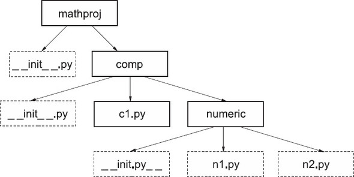

Packages
====================


### *This lab covers*

-   [Defining a package]
-   [Creating a simple package]
-   [Exploring a concrete example]
-   [Using the [\_\_all\_\_] attribute]
-   [Using packages properly]


Modules make reusing small chunks of code easy. The problem comes when
the project grows and the code you want to reload outgrows, either
physically or logically, what would fit into a single file. If having
one giant module file is an unsatisfactory solution, having a host of
little unconnected modules isn't much better. The answer to this problem
is to combine related modules into a package.


### What is a package?


A *module* is a file containing code. A module defines a group of
usually related Python functions or other objects. The name of the
module is derived from the name of the file.


When you understand modules, packages are easy, because a
package is a directory containing code and possibly further
subdirectories. A package contains a group of usually related code files
(modules). The name of the package is derived from the name of the main
package directory.


Packages are a natural extension of the module concept and are designed
to handle very large projects. Just as modules group related functions,
classes, and variables, packages group related modules.


### A first example


To see how packages might work in practice, consider a design layout for
a type of project that by nature is very large: a generalized
mathematics package along the lines of Mathematica, Maple, or MATLAB.
Maple, for example, consists of thousands of files, and some sort of
hierarchical structure is vital to keeping such a project ordered. Call
your project as a whole [mathproj].


You can organize such a project in many ways, but a reasonable design
splits the project into two parts: [ui], consisting of the UI
elements, and [comp], the computational elements. Within
[comp], it may make sense to further segment the computational
aspect into [symbolic] (real and complex symbolic computation,
such as high school algebra) and [numeric] (real and complex
numerical computation, such as numerical integration). Then it may make
sense to have a constants.py file in both the [symbolic] and
[numeric] parts of the project.


The constants.py file in the numeric part of the project defines pi as


```
pi = 3.141592
```


whereas the constants.py file in the symbolic part of the project
defines pi as


```
class PiClass:
    def __str__(self):
        return "PI"
pi = PiClass()
```


This means that a name like [pi] can be used in (and imported
from) two different files named constants.py, as shown in [figure
18.1].


##### Figure 18.1. Organizing a math package


The symbolic constants.py file defines [pi] as an abstract Python
object, the sole instance of the [PiClass] class. As the system is
developed, various operations can be implemented in this class, which
return symbolic rather than numeric results.


There's a natural mapping from this design structure to a directory
structure. The top-level directory of the project, called
[mathproj], contains subdirectories [ui] and [comp];
[comp] in turn contains subdirectories [symbolic] and
[numeric]; and each of [symbolic] and [numeric]
contains its own [constants.pi] file.


Given this directory structure, and assuming that the root mathproj
directory is installed somewhere in the Python search path, Python code
both inside and outside the [mathproj] package can access the two
variants of [pi] as [mathproj.symbolic.constants.pi] and
[mathproj.numeric.constants.pi]. In other words, the Python name
for an item in the package is a reflection of the directory pathname to
the file containing that item.


That's what packages are all about. They're ways of organizing very
large collections of Python code into coherent wholes, by allowing the
code to be split among different files and directories and imposing a
module/submodule naming scheme based on the directory structure of the
package files. Unfortunately, packages aren't this simple in practice
because details intrude to make their use more complex than their
theory. The practical aspects of packages are the basis for the
remainder of this lab.


### A concrete example


The rest of this lab uses a running example to illustrate the inner
workings of the package mechanism (see [figure
18.2]).
Filenames and paths are shown in plain text to clarify whether I'm
talking about a file/directory or the module/package defined by that
file/directory. The files you'll be using in your example package are
shown in [listings
18.1]
through
[18.6].


##### Listing 18.1. File mathproj/\_\_init\_\_.py


```
print("Hello from mathproj init")
__all__ = ['comp']
version = 1.03
```


##### Figure 18.2. Example package




##### Listing 18.2. File mathproj/comp/\_\_init\_\_.py


```
__all__ = ['c1']
print("Hello from mathproj.comp init")
```


##### Listing 18.3. File mathproj/comp/c1.py


```
x = 1.00
```


##### Listing 18.4. File mathproj/comp/numeric/\_\_init\_\_.py


```
print("Hello from numeric init")
```


##### Listing 18.5. File mathproj/comp/numeric/n1.py


```
from mathproj import version
from mathproj.comp import c1
from mathproj.comp.numeric.n2 import h
def g():
    print("version is", version)
    print(h())
```


##### Listing 18.6. File mathproj/comp/numeric/n2.py


```
def h():
    return "Called function h in module n2"
```


For the purposes of the examples in this
chapter, assume that you've created these files in a mathproj directory
that's on the Python search path. (It's sufficient to ensure that the
current working directory for Python is the directory containing
mathproj when executing these examples.)


##### Note


In most of the examples in this course, it's not necessary to start up a
new Python shell for each example. You can usually execute the examples
in a Python shell that you've used for previous examples and still get
the results shown. *This isn't true for the examples in this lab*,
however, because the Python namespace must be clean (unmodified by
previous [import] statements) for the examples to work properly.
If you do run the examples that follow, *please ensure that you run each
separate example in its own shell.* In IDLE, this requires exiting and
restarting the program, not just closing and reopening its Shell window.


#### \_\_init\_\_.py files in packages


You'll have noticed that all the directories in your package---mathproj,
mathproj/comp, and mathproj/numeric---contain a file called
[\_\_init\_\_.py]. An [\_\_init\_\_.py] file serves two
purposes:


-   [Python requires that a directory contain an [\_\_init\_\_.py]
    file before it can be recognized as a package. This requirement
    prevents directories containing
    miscellaneous
    Python code from being accidentally imported as though they defined
    a package.]
-   [The [\_\_init\_\_.py] file is automatically executed by
    Python the first time a package or subpackage is loaded. This
    execution permits whatever package initialization you desire.]


The first point is usually more important. For many packages, you won't
need to put anything in the package's [\_\_init\_\_.py] file; just
make sure that an empty [\_\_init\_\_.py] file is present.


#### Basic use of the mathproj package


Before getting into the details of packages, look at accessing items
contained in the [mathproj] package. Start a new Python shell, and
do the following:


```
>>> import mathproj
Hello from mathproj init
```


If all goes well, you should get another input prompt and no error
messages. Also, the message [\"Hello from mathproj init\"] should
be printed to the screen by code in the [mathproj/\_\_init\_\_.py]
file. I talk more about [\_\_init\_\_.py] files soon; for now, all
you need to know is that the files run automatically whenever a package
is first loaded.


The [mathproj/\_\_init\_\_.py] file assigns 1.03 to the variable
[version]. [version] is in the scope of the [mathproj]
package namespace, and after it's created, you can see it via
[mathproj], even from outside the [mathproj/\_\_init\_\_.py]
file:


```
>>> mathproj.version
1.03
```


In use, packages can look a lot like modules; they can provide access to
objects defined within them via attributes. This fact isn't surprising,
because packages are a generalization of modules.


#### Loading subpackages and submodules


Now start looking at how the various files defined in the
[mathproj] package interact with one another. To do so, invoke the
function [g] defined in the file
[mathproj/comp/numeric/n1.py]. The first obvious question is
whether this module has been loaded. You've already loaded
[mathproj], but what about its subpackage? To see whether it's
known to Python, type


```
>>> mathproj.comp.numeric.n1
Traceback (most recent call last):
  File "<stdin>", line 1, in <module>
AttributeError: module 'mathproj' has no attribute 'comp'
```


In other words, loading the top-level module of a package isn't enough
to load all the submodules, which is in keeping with Python's philosophy
that it shouldn't do things behind your back. Clarity is more important
than conciseness.


This restriction is simple enough to
overcome. You import the module of interest and then execute the
function [g] in that module:


```
>>> import mathproj.comp.numeric.n1
Hello from mathproj.comp init
Hello from numeric init
>>> mathproj.comp.numeric.n1.g()
version is 1.03
Called function h in module n2
```


Notice, however, that the lines beginning with [Hello] are printed
out as a side effect of loading [mathproj.comp.numeric.n1]. These
two lines are printed out by [print] statements in the
[\_\_init\_\_.py] files in mathproj/comp and
mathproj/comp/numeric. In other words, before Python can import
[mathproj.comp.numeric.n1], it has to import [mathproj.comp]
and then [mathproj.comp.numeric]. Whenever a package is first
imported, its associated [\_\_init\_\_.py] file is executed,
resulting in the [Hello] lines. To confirm that both
[mathproj.comp] and [mathproj.comp.numeric] are imported as
part of the process of importing [mathproj.comp.numeric.n1], you
can check to see that [mathproj.comp] and
[mathproj.comp.numeric] are now known to the Python session:


```
>>> mathproj.comp
<module 'mathproj.comp' from 'mathproj/comp/__init__.py'>
>>> mathproj.comp.numeric
<module 'mathproj.comp.numeric'  from 'mathproj/comp/numeric/__init__.py'>
```


#### import statements within packages


Files within a package don't automatically have access to objects
defined in other files in the same package. As in outside modules, you
must use [import] statements to explicitly access objects from
other package files. To see how this use of [import] works in
practice, look back at the [n1] subpackage. The code contained in
[n1.py] is


```
from mathproj import version
from mathproj.comp import c1
from mathproj.comp.numeric.n2 import h
def g():
    print("version is", version)
    print(h())
```


[g] makes use of both [version] from the top-level
[mathproj] package and the function [h] from the [n2]
module; hence, the module containing [g] must import both
[version] and [h] to make them accessible. You import
[version] as you would in an [import] statement from outside
the [mathproj] package: by saying [from mathproj import
version]. In this example, you explicitly import [h] into
the code by saying [from mathproj.comp.numeric.n2 import h], and
this technique works in any file; explicit imports of package files are
always allowed. But because [n2.py] is in the same
directory as [n1.py], you can also use
a relative import by prepending a single dot to the submodule name. In
other words, you can say


```
from .n2 import h
```


as the third line in [n1.py], and it works fine.


You can add more dots to move up more levels in the package hierarchy,
and you can add module names. Instead of writing


```
from mathproj import version
from mathproj.comp import c1
from mathproj.comp.numeric.n2 import h
```


you could have written the imports of n1.py as


```
from ... import version
from ..  import c1
from . n2 import h
```


Relative imports can be handy and quick to type, but be aware that
they're *relative* to the module's [\_\_name\_\_] property.
Therefore, any module being executed as the main module and thus having
[\_\_main\_\_] as its [\_\_name\_\_] can't use relative
imports.


### The \_\_all\_\_ attribute


If you look back at the various [\_\_init\_\_.py] files defined in
[mathproj], you'll notice that some of them define an attribute
called [\_\_all\_\_]. This attribute has to do with execution of
statements of the form [from \... import \*], and it requires
explanation.


Generally speaking, you'd hope that if outside code executed the
statement [from mathproj import \*], it would import all
nonprivate names from [mathproj]. In practice, life is more
difficult. The primary problem is that some operating systems have an
ambiguous definition of case when it comes to filenames. Because objects
in packages can be defined by files or directories, this situation leads
to ambiguity as to the exact name under which a subpackage might be
imported. If you say [from mathproj import \*], will [comp]
be imported as [comp], [Comp], or [COMP]? If you were
to rely only on the name as reported by the operating system, the
results might be unpredictable.


There's no good solution to this problem, which is an inherent one
caused by poor OS design. As the best possible fix, the
[\_\_all\_\_] attribute was introduced. If present in an
[\_\_init\_\_.py] file, [\_\_all\_\_] should give a list of
strings, defining those names that are to be imported when a [from \...
import \*] is executed on that particular package. If
[\_\_all\_\_] isn't present, [from \... import \*] on the
given package does nothing. Because case in a text file is always
meaningful, the names under which objects are imported aren't ambiguous,
and if the operating system thinks that [comp] is the same as
[COMP], that's its problem.


Fire up Python again, and try the following:


```
>>> from mathproj import *
Hello from mathproj init
Hello from mathproj.comp init
```


The [\_\_all\_\_] attribute in
[mathproj/\_\_init\_\_.py] contains a single entry, [comp],
and the [import] statement imports only [comp]. It's easy
enough to check whether [comp] is now known to the Python session:


```
>>> comp
<module 'mathproj.comp' from 'mathproj/comp/__init__.py'>
```


But note that there's no recursive importing of names with a [from \...
import \*] statement. The [\_\_all\_\_] attribute for the
[comp] package contains [c1], but [c1] isn't magically
loaded by your [from mathproj import \*] statement:


```
>>> c1
Traceback (most recent call last):
  File "<stdin>", line 1, in <module>
NameError: name 'c1' is not defined
```


To insert names from [mathproj.comp], you must again do an
explicit import:


```
>>> from mathproj.comp import c1
>>> c1
<module 'mathproj.comp.c1' from 'mathproj/comp/c1.py'>
```

##### Quick Check: Packages


Suppose that you're writing a package that takes a URL, retrieves all
images on the page pointed to by that URL, resizes them to a standard
size, and stores them. Leaving aside the exact details of how each of
these functions will be coded, how would you organize those features
into a package?


### Summary


-   [Packages let you create libraries of code that span multiple files
    and directories.]
-   [Using packages allows better organization of large collections of
    code than single modules would allow.]
-   [You should be wary of nesting directories in your packages more
    than one or two levels deep unless you have a very large and complex
    library.]
