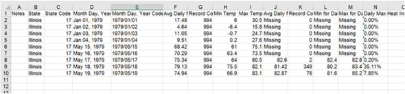

Processing data files 
=================================


### *This lab covers*

-   [Using ETL (extract-transform-load)]
-   [Reading text data files (plain text and CSV)]
-   [Reading spreadsheet files]
-   [Normalizing, cleaning, and sorting data]
-   [Writing data files]


Much of the data available is contained in text files. This data can
range from unstructured text, such as a corpus of tweets or literary
texts, to more structured data in which each row is a record and the
fields are delimited by a special character, such as a comma, a tab, or
a pipe (\|). Text files can be huge; a data set can be spread over tens
or even hundreds of files, and the data in it can be incomplete or
horribly dirty. With all the variations, it's almost inevitable that
you'll need to read and use data from text files. This lab gives you
strategies for using Python to do exactly that.


### Welcome to ETL


The
need to get data out of files, parse it, turn it into a useful format,
and then do something with it has been around for as long as there have
been data files. In fact, there is a standard term for the process:
extract-transform-load (ETL). The extraction refers to the process of
reading a data source and parsing it, if necessary. The transformation
can be cleaning and normalizing the data, as well as combining, breaking
up, or reorganizing the records it contains. The loading refers to
storing the transformed data in a new place, either a different file or
a database. This lab deals with the basics of ETL in Python,
starting with text-based data files and storing the transformed data in
other files. I look at more structured data files in [chapter
22]
and storage in databases in [chapter
23].


### Reading text files


The first part of ETL---the "extract" portion---involves opening a file
and reading its contents. This process seems like a simple one, but even
at this point there can be issues, such as the file's size. If a file is
too large to fit into memory and be manipulated, you need to structure
your code to handle smaller segments of the file, possibly operating one
line at a time.


#### Text encoding: ASCII, Unicode, and others


Another possible pitfall is in the encoding. This lab deals with
text files, and in fact, much of the data exchanged in the real world is
in text files. But the exact nature of *text* can vary from application
to application, from person to person, and of course from country to
country.


Sometimes, *text* means something in the ASCII encoding, which has 128
characters, only 95 of which are printable. The good news about ASCII
encoding is that it's the lowest common denominator of most data
exchange. The bad news is that it doesn't begin to handle the
complexities of the many alphabets and writing systems of the world.
Reading files using ASCII encoding is almost certain to cause trouble
and throw errors on character values that it doesn't understand, whether
it's a German ü, a Portuguese ç, or something from almost any language
other than English.


These errors arise because ASCII is based on 7-bit values, whereas the
bytes in a typical file are 8 bits, allowing 256 possible values as
opposed to the 128 of a 7-bit value. It's routine to use those
additional values to store additional characters---anything from extra
punctuation (such as the printer's en dash and em dash) to symbols (such
as the trademark, copyright, and degree symbols) to accented versions of
alphabetical characters. The problem has always been that if, in reading
a text file, you encounter a character in the 128 outside the ASCII
range, you have no way of knowing for sure how it was encoded. Is the
character value of 214, say, a division symbol, an Ö, or something else?
Short of having the code that created the file, you have no way to know.


##### Unicode and UTF-8


One way to mitigate this
confusion is Unicode. The Unicode encoding called UTF-8 accepts the
basic ASCII characters without any change but also allows an almost
unlimited set of other characters and symbols according to the Unicode
standard. Because of its flexibility, UTF-8 was used in more 85% of web
pages served at the time I wrote this lab, which means that your
best bet for reading text files is to assume UTF-8 encoding. If the
files contain only ASCII characters, they'll still be read correctly,
but you'll also be covered if other characters are encoded in UTF-8. The
good news is that the Python 3 string data type was designed to handle
Unicode by default.


Even with Unicode, there'll be occasions when your text contains values
that can't be successfully encoded. Fortunately, the [open]
function in Python accepts an optional errors parameter that tells it
how to deal with encoding errors when reading or writing files. The
default option is [\'strict\'], which causes an error to be raised
whenever an encoding error is encountered. Other useful options are
[\'ignore\'], which causes the character causing the error to be
skipped; [\'replace\'], which causes the character to be replaced
by a marker character (often, ?); [\'backslashreplace\'], which
replaces the character with a backslash escape sequence; and
[\'surrogateescape\'], which translates the offending character to
a private Unicode code point on reading and back to the original
sequence of bytes on writing. Your particular use case will determine
how strict you need to be in handling or resolving encoding issues.


Look at a short example of a file containing an invalid UTF-8 character,
and see how the different options handle that character. First, write
the file, using bytes and binary mode:


```
>>> open('test.txt', 'wb').write(bytes([65, 66, 67, 255, 192,193]))
```


This code results in a file that contains "ABC" followed by three
non-ASCII characters, which may be rendered differently depending on the
encoding used. If you use vim to look at the file, you see


```
ABCÿÀÁ
~
```


Now that you have the file, try reading it with the default
[\'strict\'] errors option:


```
>>> x = open('test.txt').read()
Traceback (most recent call last):
  File "<stdin>", line 1, in <module>
  File "/usr/local/lib/python3.6/codecs.py", line 321, in decode
    (result, consumed) = self._buffer_decode(data, self.errors, final)
UnicodeDecodeError: 'utf-8' codec can't decode byte 0xff in position 3:
     invalid start byte
```


The fourth byte, which had a value of 255, isn't a valid UTF-8 character
in that position, so the [\'strict\'] errors setting raises an
exception. Now see how the other
error options
handle the same file, keeping in mind that the last three characters
raise an error:


```
>>> open('test.txt', errors='ignore').read()
'ABC'
>>> open('test.txt', errors='replace').read()
'ABC'
>>> open('test.txt', errors='surrogateescape').read()
'ABC\udcff\udcc0\udcc1'
>>> open('test.txt', errors='backslashreplace').read()
'ABC\\xff\\xc0\\xc1'
>>>
```


If you want any problem characters to disappear, [\'ignore\'] is
the option to use. The [\'replace\'] option only marks the place
occupied by the invalid character, and the other options in different
ways attempt to preserve the invalid characters without interpretation.


#### Unstructured text


Unstructured text files are the easiest sort of data to read but the
hardest to extract information from. Processing unstructured text can
vary enormously, depending on both the nature of the text and what you
want to do with it, so any comprehensive discussion of text processing
is beyond the scope of this course. A short example, however, can
illustrate some of the basic issues and set the stage for a discussion
of structured text data files.


One of the simplest issues is deciding what forms a basic logical unit
in the file. If you have a corpus of thousands of tweets, the text of
*Moby Dick*, or a collection of news stories, you need to be able to
break them up into cohesive units. In the case of tweets, each may fit
onto a single line, and you can read and process each line of the file
fairly simply.


In the case of *Moby Dick* or even a news story, the problem can be
trickier. You may not want to treat all of a novel or news item as a
single item in many cases. But if that's the case, you need to decide
what sort of unit you do want and then come up with a strategy to divide
the file accordingly. Perhaps you want to consider the text paragraph by
paragraph. In that case, you need to identify how paragraphs are
separated in your file and create your code accordingly. If a paragraph
is the same as a line in the text file, the job is easy. Often, however,
the line breaks in a text file are shorter, and you need to do a bit
more work.


Now look at a couple of examples:


```
Call me Ishmael.  Some years ago--never mind how long precisely--
having little or no money in my purse, and nothing particular
to interest me on shore, I thought I would sail about a little
and see the watery part of the world.  It is a way I have
of driving off the spleen and regulating the circulation.
Whenever I find myself growing grim about the mouth;
whenever it is a damp, drizzly November in my soul; whenever I
find myself involuntarily pausing before coffin warehouses,
and bringing up the rear of every funeral I meet;
and especially whenever my hypos get such an upper hand of me,
that it requires a strong moral principle to prevent me from
deliberately stepping into the street, and methodically knocking
people's hats off--then, I account it high time to get to sea
as soon as I can.  This is my substitute for pistol and ball.
With a philosophical flourish Cato throws himself upon his sword;
I quietly take to the ship.  There is nothing surprising in this.
If they but knew it, almost all men in their degree, some time
or other, cherish very nearly the same feelings towards
the ocean with me.

There now is your insular city of the Manhattoes, belted round by wharves
as Indian isles by coral reefs--commerce surrounds it with her surf.
Right and left, the streets take you waterward.  Its extreme downtown
is the battery, where that noble mole is washed by waves, and cooled
by breezes, which a few hours previous were out of sight of land.
Look at the crowds of water-gazers there.
```


In the sample, which is indeed the beginning of *Moby
Dick*, the lines are broken more or less as they might be on the page,
and paragraphs are indicated by a single blank line. If you want to deal
with each paragraph as a unit, you need to break the text on the blank
lines. Fortunately, this task is easy if you use the string
[split()] method. Each newline character in a string can
represented by [\"\\n\"]. Naturally, the last line of a
paragraph's text ends with a newline, and if the next line is blank,
it's immediately followed by a second newline for the blank line:


```
>>> moby_text = open("moby_01.txt").read()
>>> moby_paragraphs = moby_text.split("\n\n")
>>> print(moby_paragraphs[1])
There now is your insular city of the Manhattoes, belted round by wharves
as Indian isles by coral reefs--commerce surrounds it with her surf.
Right and left, the streets take you waterward.  Its extreme downtown
is the battery, where that noble mole is washed by waves, and cooled
by breezes, which a few hours previous were out of sight of land.
Look at the crowds of water-gazers there.
```


Splitting the text into paragraphs is a very simple first step in
handling unstructured text. You might also need to do more normalization
of the text before processing. Suppose that you want to count the rate
of occurrence of every word in a text file. If you just split the file
on whitespace, you get a list of words in the file. Counting their
occurrences accurately will be hard, however, because *This*, *this,*
*this.*, and *this,* are not the same. The way to make this code work is
to normalize the text by removing the punctuation and making everything
the same case before processing. For the example text above, the code
for a normalized list of words might look like this:


```
>>> moby_text = open("moby_01.txt").read()
>>> moby_paragraphs = moby_text.split("\n\n")
>>> moby = moby_paragraphs[1].lower()
>>> moby = moby.replace(".", "")
>>> moby = moby.replace(",", "")
>>> moby_words = moby.split()
>>> print(moby_words)
['there', 'now', 'is', 'your', 'insular', 'city', 'of', 'the', 'manhattoes,',
     'belted', 'round', 'by', 'wharves', 'as', 'indian', 'isles', 'by',
     'coral', 'reefs--commerce', 'surrounds', 'it', 'with', 'her', 'surf',
     'right', 'and', 'left,', 'the', 'streets', 'take', 'you', 'waterward',
     'its', 'extreme', 'downtown', 'is', 'the', 'battery,', 'where', 'that',
     'noble', 'mole', 'is', 'washed', 'by', 'waves,', 'and', 'cooled', 'by',
     'breezes,', 'which', 'a', 'few', 'hours', 'previous', 'were', 'out',
     'of', 'sight', 'of', 'land', 'look', 'at', 'the', 'crowds', 'of',
     'water-gazers', 'there']
```


##### Quick Check: Normalization


Look closely at the list of words generated. Do you see any issues with
the normalization so far? What other issues do you think you might
encounter in a longer section of text? How do you think you might deal
with those issues?


#### Delimited flat files


Although reading unstructured text files is easy, the downside is their
very lack of structure. It's often much more useful to have some
organization in the file to help with picking out individual values. The
simplest way is to break the file into lines and have one element of
information per line. You may have a list of the names of files to be
processed, a list of people's names that need to be printed (on name
tags, say), or maybe a series of temperature readings from a remote
monitor. In such cases, the data parsing is very simple: You read in the
line and convert it to the right type, if necessary. Then the file is
ready to use.


Most of the time, however, things aren't not quite so simple. Usually,
you need to group multiple related bits of information, and you need
your code to read them in together. The common way to do this is to put
the related pieces of information on the same line, separated by a
special character. That way, as you read each line of the file, you can
use the special characters to split the file into its different fields
and put the values of those fields in variables for later processing.


This file is a simple example of temperature data in delimited format:


```
State|Month Day, Year Code|Avg Daily Max Air Temperature (F)|Record Count for
     Daily Max Air Temp (F)
Illinois|1979/01/01|17.48|994
Illinois|1979/01/02|4.64|994
Illinois|1979/01/03|11.05|994
Illinois|1979/01/04|9.51|994
Illinois|1979/05/15|68.42|994
Illinois|1979/05/16|70.29|994
Illinois|1979/05/17|75.34|994
Illinois|1979/05/18|79.13|994
Illinois|1979/05/19|74.94|994
```


This
data is pipe-delimited, meaning that each field in the line is separated
by the pipe (\|) character, in this case giving you four fields: the
state of the observations, the date of the observations, the average
high temperature, and the number of stations reporting. Other common
delimiters are the tab character and the comma. The comma is perhaps the
most common, but the delimiter could be any character you don't expect
to occur in the values. (More about that issue next.) Comma delimiters
are so common that this format is often called CSV (comma-separated
values), and files of this type often have a .csv extension as a hint of
their format.


Whatever character is being used as the delimiter, if you know what
character it is, you can write your own code in Python to break each
line into its fields and return them as a list. In the previous case,
you can use the string [split()] method to break a line into a
list of values:


```
>>> line = "Illinois|1979/01/01|17.48|994"
>>> print(line.split("|"))
['Illinois', '1979/01/01', '17.48', '994']
```


Note that this technique is very easy to do but leaves all the values as
strings, which might not be convenient for later processing.


##### Try this: Read A file


Write the code to read a text file (assume temp\_data\_pipes\_00a.txt,
as shown in the example), split each line of the file into a list of
values, and add that list to a single list of records.


What issues or problems did you encounter in implementing this code? How
might you go about converting the last three fields to the correct date,
real, and int types?


#### The csv module


If you need to do much processing of delimited data files, you should
become familiar with the [csv] module and its options. When I've
been asked to name my favorite module in the Python standard library,
more than once I've cited the [csv] module---not because it's
glamorous (it isn't), but because it has probably saved me more work and
kept me from more self-inflicted bugs over my career than any other
module.


The [csv] module is a perfect case of Python's "batteries
included" philosophy. Although it's perfectly possible, and in many
cases not even terribly hard, to roll your own code to read delimited
files, it's even easier and much more reliable to use the Python module.
The [csv] module has been tested and optimized, and it has
features that you probably wouldn't bother to write if you had to do it
yourself, but that are truly handy and time-saving when available.


Look at the previous data, and decide how you'd read it by using the
[csv] module. The code to parse the data has to do two things:
read each line and strip off the trailing newline character, and then
break up the line on the pipe character and append that list of values
to a list of lines. Your solution to the exercise might look something
like this:


```
>>> results = []
>>> for line in open("temp_data_pipes_00a.txt"):
...     fields = line.strip().split("|")
...     results.append(fields)
...
>>> results
[['State', 'Month Day, Year Code', 'Avg Daily Max Air Temperature (F)',
     'Record Count for Daily Max Air Temp (F)'], ['Illinois', '1979/01/01',
     '17.48', '994'], ['Illinois', '1979/01/02', '4.64', '994'], ['Illinois',
     '1979/01/03', '11.05', '994'], ['Illinois', '1979/01/04', '9.51',
     '994'], ['Illinois', '1979/05/15', '68.42', '994'], ['Illinois', '1979/
     05/16', '70.29', '994'], ['Illinois', '1979/05/17', '75.34', '994'],
     ['Illinois', '1979/05/18', '79.13', '994'], ['Illinois', '1979/05/19',
     '74.94', '994']]
```


To do the same thing with the [csv] module, the code might be
something like this:


```
>>> import csv
>>> results = [fields for fields in
     csv.reader(open("temp_data_pipes_00a.txt", newline=''), delimiter="|")]
>>> results
[['State', 'Month Day, Year Code', 'Avg Daily Max Air Temperature (F)',
     'Record Count for Daily Max Air Temp (F)'], ['Illinois', '1979/01/01',
     '17.48', '994'], ['Illinois', '1979/01/02', '4.64', '994'], ['Illinois',
     '1979/01/03', '11.05', '994'], ['Illinois', '1979/01/04', '9.51',
     '994'], ['Illinois', '1979/05/15', '68.42', '994'], ['Illinois', '1979/
     05/16', '70.29', '994'], ['Illinois', '1979/05/17', '75.34', '994'],
     ['Illinois', '1979/05/18', '79.13', '994'], ['Illinois', '1979/05/19',
     '74.94', '994']]
```


In this simple case, the gain over rolling your own code doesn't seem so
great. Still, the code is two lines shorter and a bit clearer, and
there's no need to worry about stripping off newline characters. The
real advantages come when you want to deal with more challenging cases.


The data in the example is real, but it's actually been simplified and
cleaned. The real data from the source is more complex. The real data
has more fields, some fields are in quotes while others are not, and the
first field is empty. The original is tab-delimited, but for the sake of
illustration, I present it as comma-delimited here:


```
"Notes","State","State Code","Month Day, Year","Month Day, Year Code",Avg
     Daily Max Air Temperature (F),Record Count for Daily Max Air Temp
     (F),Min Temp for Daily Max Air Temp (F),Max Temp for Daily Max Air Temp
     (F),Avg Daily Max Heat Index (F),Record Count for Daily Max Heat Index
     (F),Min for Daily Max Heat Index (F),Max for Daily Max Heat Index
     (F),Daily Max Heat Index (F) % Coverage

,"Illinois","17","Jan 01, 1979","1979/01/
     01",17.48,994,6.00,30.50,Missing,0,Missing,Missing,0.00%
,"Illinois","17","Jan 02, 1979","1979/01/02",4.64,994,-
     6.40,15.80,Missing,0,Missing,Missing,0.00%
,"Illinois","17","Jan 03, 1979","1979/01/03",11.05,994,-
     0.70,24.70,Missing,0,Missing,Missing,0.00%
,"Illinois","17","Jan 04, 1979","1979/01/
     04",9.51,994,0.20,27.60,Missing,0,Missing,Missing,0.00%
,"Illinois","17","May 15, 1979","1979/05/
     15",68.42,994,61.00,75.10,Missing,0,Missing,Missing,0.00%
,"Illinois","17","May 16, 1979","1979/05/
     16",70.29,994,63.40,73.50,Missing,0,Missing,Missing,0.00%
,"Illinois","17","May 17, 1979","1979/05/
     17",75.34,994,64.00,80.50,82.60,2,82.40,82.80,0.20%
,"Illinois","17","May 18, 1979","1979/05/
     18",79.13,994,75.50,82.10,81.42,349,80.20,83.40,35.11%
,"Illinois","17","May 19, 1979","1979/05/
     19",74.94,994,66.90,83.10,82.87,78,81.60,85.20,7.85%
```


Notice that some fields include commas. The convention in that case is
to put quotes around a field to indicate that it's not supposed to be
parsed for delimiters. It's quite common, as here, to quote only some
fields, especially those in which a value might contain the delimiter
character. It also happens, as here, that some fields are quoted even if
they're not likely to contain the delimiting character.


In a case like this one, your home-grown code becomes cumbersome. Now
you can no longer split the line on the delimiting character; you need
to be sure that you look only at delimiters that aren't inside quoted
strings. Also, you need to remove the quotes around quoted strings,
which might occur in any position or not at all. With the [csv]
module, you don't need to change your code at all. In fact, because the
comma is the default delimiter, you don't even need to specify it:


```
>>> results2 = [fields for fields in csv.reader(open("temp_data_01.csv",
     newline=''))]
>>> results2
[['Notes', 'State', 'State Code', 'Month Day, Year', 'Month Day, Year Code',
     'Avg Daily Max Air Temperature (F)', 'Record Count for Daily Max Air
     Temp (F)', 'Min Temp for Daily Max Air Temp (F)', 'Max Temp for Daily
     Max Air Temp (F)', 'Avg Daily Min Air Temperature (F)', 'Record Count
     for Daily Min Air Temp (F)', 'Min Temp for Daily Min Air Temp (F)', 'Max
     Temp for Daily Min Air Temp (F)', 'Avg Daily Max Heat Index (F)',
     'Record Count for Daily Max Heat Index (F)', 'Min for Daily Max Heat
     Index (F)', 'Max for Daily Max Heat Index (F)', 'Daily Max Heat Index
     (F) % Coverage'], ['', 'Illinois', '17', 'Jan 01, 1979', '1979/01/01',
     '17.48', '994', '6.00', '30.50', '2.89', '994', '-13.60', '15.80',
     'Missing', '0', 'Missing', 'Missing', '0.00%'], ['', 'Illinois', '17',
     'Jan 02, 1979', '1979/01/02', '4.64', '994', '-6.40', '15.80', '-9.03',
     '994', '-23.60', '6.60', 'Missing', '0', 'Missing', 'Missing', '0.00%'],
     ['', 'Illinois', '17', 'Jan 03, 1979', '1979/01/03', '11.05', '994', '-
     0.70', '24.70', '-2.17', '994', '-18.30', '12.90', 'Missing', '0',
     'Missing', 'Missing', '0.00%'], ['', 'Illinois', '17', 'Jan 04, 1979',
     '1979/01/04', '9.51', '994', '0.20', '27.60', '-0.43', '994', '-16.30',
     '16.30', 'Missing', '0', 'Missing', 'Missing', '0.00%'], ['',
     'Illinois', '17', 'May 15, 1979', '1979/05/15', '68.42', '994', '61.00',
     '75.10', '51.30', '994', '43.30', '57.00', 'Missing', '0', 'Missing',
     'Missing', '0.00%'], ['', 'Illinois', '17', 'May 16, 1979', '1979/05/
     16', '70.29', '994', '63.40', '73.50', '48.09', '994', '41.10', '53.00',
     'Missing', '0', 'Missing', 'Missing', '0.00%'], ['', 'Illinois', '17',
     'May 17, 1979', '1979/05/17', '75.34', '994', '64.00', '80.50', '50.84',
     '994', '44.30', '55.70', '82.60', '2', '82.40', '82.80', '0.20%'], ['',
     'Illinois', '17', 'May 18, 1979', '1979/05/18', '79.13', '994', '75.50',
     '82.10', '55.68', '994', '50.00', '61.10', '81.42', '349', '80.20',
     '83.40', '35.11%'], ['', 'Illinois', '17', 'May 19, 1979', '1979/05/19',
     '74.94', '994', '66.90', '83.10', '58.59', '994', '50.90', '63.20',
     '82.87', '78', '81.60', '85.20', '7.85%']]
```


Notice
that the extra quotes have been removed and that any field values with
commas have the commas intact inside the fields---all without any more
characters in the command.


##### Quick Check: Handling Quoting


Consider how you'd approach the problems of handling quoted fields and
embedded delimiter characters if you didn't have the [csv]
library. Which would be easier to handle: the quoting or the embedded
delimiters?


#### Reading a csv file as a list of dictionaries


In the preceding examples, you got a row of data back as a list of
fields. This result works fine in many cases, but sometimes it may be
handy to get the rows back as dictionaries where the field name is the
key. For this use case, the [csv] library has a
[DictReader], which can take a list of fields as a parameter or
can read them from the first line of the data. If you want to open the
data with a [DictReader], the code would look like this:


```
>>> results = [fields for fields in csv.DictReader(open("temp_data_01.csv",
     newline=''))]
>>> results[0]
OrderedDict([('Notes', ''), ('State', 'Illinois'), ('State Code', '17'),
   ('Month Day, Year', 'Jan 01, 1979'), ('Month Day, Year Code', '1979/01/
   01'), ('Avg Daily Max Air Temperature (F)', '17.48'), ('Record Count for
   Daily Max Air Temp (F)', '994'), ('Min Temp for Daily Max Air Temp (F)',
   '6.00'), ('Max Temp for Daily Max Air Temp (F)', '30.50'), ('Avg Daily
   Min Air Temperature (F)', '2.89'), ('Record Count for Daily Min Air Temp
   (F)', '994'), ('Min Temp for Daily Min Air Temp (F)', '-13.60'), ('Max
   Temp for Daily Min Air Temp (F)', '15.80'), ('Avg Daily Max Heat Index
   (F)', 'Missing'), ('Record Count for Daily Max Heat Index (F)', '0'),
   ('Min for Daily Max Heat Index (F)', 'Missing'), ('Max for Daily Max
   Heat Index (F)', 'Missing'), ('Daily Max Heat Index (F) % Coverage',
   '0.00%')])
```


Note that the [csv.DictReader] returns [OrderedDicts], so
the fields stay in their original order. Although their representation
is a little different, the fields still behave like dictionaries:


```
>>> results[0]['State']
'Illinois'
```


If the data is particularly complex, and specific fields need to be
manipulated, a [DictReader] can make it much easier to be sure
you're getting the right field; it also makes your code somewhat easier
to understand. Conversely, if your data set is quite large, you need to
keep in mind that [DictReader] can take on the order of twice as
long to read the same amount of data.


### Excel files


The other common file format that I discuss in this lab is the Excel
file, which is the format that Microsoft Excel uses to store
spreadsheets. I include Excel files here because the way you end up
treating them is very similar to the way you treat delimited files. In
fact, because Excel can both read and write CSV files, the quickest and
easiest way to extract data from an Excel spreadsheet file often is to
open it in Excel and then save it as a CSV file. This procedure doesn't
always make sense, however, particularly if you have a lot of files. In
that case, even though you could theoretically automate the process of
opening and saving each file in CSV format, it's probably faster to deal
with the Excel files directly.


It's beyond the scope of this course to have an in-depth discussion of
spreadsheet files, with their options for multiple sheets in the same
file, macros, and various formatting options. Instead, in this section I
look at an example of reading a simple one-sheet file simply to extract
the data from it.


As it happens, Python's standard library doesn't have a module to read
or write Excel files. To read that format, you need to install an
external module. Fortunately, several modules are available to do the
job. For this example, you use one called OpenPyXL, which is available
from the Python package repository. You can install it with the
following command from a command line:


```
$pip install openpyxl
```


Here's a view of the previous data, but in a spreadsheet:





Reading the file is fairly simple, but it's still more work than CSV
files require. First, you need to load the workbook; next, you need to
get the specific sheet; then you can iterate over the rows; and from
there, you extract the values of the cells. Some sample code to read the
spreadsheet looks like this:


```
>>> from openpyxl import load_workbook
>>> wb = load_workbook('temp_data_01.xlsx')
>>> results = []
>>> ws = wb.worksheets[0]
>>> for row in ws.iter_rows():
...     results.append([cell.value for cell in row])
...
>>> print(results)
[['Notes', 'State', 'State Code', 'Month Day, Year', 'Month Day, Year Code',
     'Avg Daily Max Air Temperature (F)', 'Record Count for Daily Max Air
     Temp (F)', 'Min Temp for Daily Max Air Temp (F)', 'Max Temp for Daily
     Max Air Temp (F)', 'Avg Daily Max Heat Index (F)', 'Record Count for
     Daily Max Heat Index (F)', 'Min for Daily Max Heat Index (F)', 'Max for
     Daily Max Heat Index (F)', 'Daily Max Heat Index (F) % Coverage'],
     [None, 'Illinois', 17, 'Jan 01, 1979', '1979/01/01', 17.48, 994, 6,
     30.5, 'Missing', 0, 'Missing', 'Missing', '0.00%'], [None, 'Illinois',
     17, 'Jan 02, 1979', '1979/01/02', 4.64, 994, -6.4, 15.8, 'Missing', 0,
     'Missing', 'Missing', '0.00%'], [None, 'Illinois', 17, 'Jan 03, 1979',
     '1979/01/03', 11.05, 994, -0.7, 24.7, 'Missing', 0, 'Missing',
     'Missing', '0.00%'], [None, 'Illinois', 17, 'Jan 04, 1979', '1979/01/
     04', 9.51, 994, 0.2, 27.6, 'Missing', 0, 'Missing', 'Missing', '0.00%'],
     [None, 'Illinois', 17, 'May 15, 1979', '1979/05/15', 68.42, 994, 61,
     75.1, 'Missing', 0, 'Missing', 'Missing', '0.00%'], [None, 'Illinois',
     17, 'May 16, 1979', '1979/05/16', 70.29, 994, 63.4, 73.5, 'Missing', 0,
     'Missing', 'Missing', '0.00%'], [None, 'Illinois', 17, 'May 17, 1979',
     '1979/05/17', 75.34, 994, 64, 80.5, 82.6, 2, 82.4, 82.8, '0.20%'],
     [None, 'Illinois', 17, 'May 18, 1979', '1979/05/18', 79.13, 994, 75.5,
     82.1, 81.42, 349, 80.2, 83.4, '35.11%'], [None, 'Illinois', 17, 'May 19,
     1979', '1979/05/19', 74.94, 994, 66.9, 83.1, 82.87, 78, 81.6, 85.2,
     '7.85%']]
```


This code gets you the same
results as the much simpler code did for a csv file. It's not surprising
that the code to read a spreadsheet is more complex, because
spreadsheets are themselves much more complex objects. You should also
be sure that you understand the way that data has been stored in the
spreadsheet. If the spreadsheet contains formatting that has some
significance, if labels need to be disregarded or handled differently,
or if formulas and references need to be processed, you need to dig
deeper into how those elements should be processed, and you need to
write more-complex code.


Spreadsheets also often have other possible issues. At this writing,
it's common for spreadsheets to be limited to around a million rows.
Although that limit sounds large, more and more often you'll need to
handle data sets that are larger. Also, spreadsheets sometimes
automatically apply inconvenient formatting. One company I worked for
had part numbers that consisted of a digit and at least one letter
followed by some combination of digits and letters. It was possible to
get a part number such as 1E20. Most spreadsheets automatically
interpret 1E20 as scientific notation and save it as 1.00E+20 (1 times
10 to the 20^th^ power) while leaving 1F20 as a string. For some reason,
it's rather difficult to keep this from happening, and particularly with
a large data set, the problem won't be detected until farther down the
pipeline, if all. For these reasons, I recommend using CSV or delimited
files when at all possible. Users usually can save a spreadsheet as CSV,
so there's usually no need put up with the extra complexity and
formatting hassles that spreadsheets involve.


### Data cleaning


One common problem you'll
encounter in processing text-based data files is dirty data. By *dirty*,
I mean that there are all sorts of surprises in the data, such as null
values, values that aren't legal for your encoding, or extra whitespace.
The data may also be unsorted or in an order that makes processing
difficult. The process of dealing with situations like these is called
*data cleaning*.


#### Cleaning


In a very simple example data clean, you might need to process a file
that was exported from a spreadsheet or other financial program, and the
columns dealing with money may have percentage and currency symbols
(such as %, \$, £, and ?), as well as extra groupings that use a period
or comma. Data from other sources may have other surprises that make
processing tricky if they're not caught in advance. Look again at the
temperature data you saw previously. The first data line looks like
this:


```
 [None, 'Illinois', 17, 'Jan 01, 1979', '1979/01/01', 17.48, 994, 6, 30.5,
     2.89, 994, -13.6, 15.8, 'Missing', 0, 'Missing', 'Missing', '0.00%']
```


Some columns, such as [\'State\'] (field 2) and [\'Notes\']
(field 1), are clearly text, and you wouldn't be likely to do much with
them. There are also two date fields in different formats, and you might
well want to do calculations with the dates, possibly to change the
order of the data and to group rows by month or day, or possibly to
calculate how far apart in time two rows are.


The rest of the fields seem to be different types of numbers; the
temperatures are decimals, and the record counts columns are integers.
Notice, however, that the heat index temperatures have a variation: When
the value for the [\'Max Temp for Daily Max Air Temp (F)\'] field
is below 80, the values for the heat index fields aren't reported, but
instead are listed as [\'Missing\'], and the record count is 0.
Also note that the [\'Daily Max Heat Index (F) % Coverage\'] field
is expressed as a percentage of the number of temperature records that
also qualify to have a heat index. Both of these issues will be
problematic if you want to do any math calculations on the values in
those fields, because both [\'Missing\'] and any number ending
with % will be parsed as strings, not numbers.


Cleaning data like this can be done at different steps in the process.
Quite often, I prefer to clean the data as it's being read from the
file, so I might well replace the [\'Missing\'] with a None value
or an empty string as the lines are being processed. You could also
leave the [\'Missing\'] strings in place and write your code so
that no math operations are performed on a value if it is
[\'Missing\'].


##### Try this: Cleaning Data


How would you handle the fields with [\'Missing\'] as possible
values for math calculations? Can you write a snippet of code that
averages one of those columns?


What
would you do with the average column at the end so that you could also
report the average coverage? In your opinion, would the solution to this
problem be at all linked to the way that the [\'Missing\'] entries
were handled?


#### Sorting


As I mentioned earlier, it's often useful to have data in the text file
sorted before processing. Sorting the data makes it easier to spot and
handle duplicate values, and it can also help bring together related
rows for quicker or easier processing. In one case, I received a 20
million--row file of attributes and values, in which arbitrary numbers
of them needed to be matched with items from a master SKU list. Sorting
the rows by the item ID made gathering each item's attributes much
faster. How you do the sorting depends on the size of the data file
relative to your available memory and on the complexity of the sort. If
all the lines of the file can fit comfortably into available memory, the
easiest thing may be to read all of the lines into a list and use the
list's sort method:


```
>>> lines = open("datafile").readlines()
>>> lines.sort()
```


You could also use the [sorted()] function, as in [sorted\_lines =
sorted(lines)]. This function preserves the order of the lines in
your original list, which usually is unnecessary. The drawback to using
the [sorted()] function is that it creates a new copy of the list.
This process takes slightly longer and consumes twice as much memory,
which might be a bigger concern.


If the data set is larger than memory and the sort is very simple (just
by an easily grabbed field), it may be easier to use an external
utility, such as the UNIX [sort] command, to preprocess the data:


```
$ sort data > data.srt
```


In either case, sorting can be done in reverse order and can be keyed by
values, not the beginning of the line. For such occasions, you need to
study the documentation of the sorting tool you choose to use. A simple
example in Python would be to make a sort of lines of text
case-insensitive. To do this, you give the [sort] method a key
function that makes the element lowercase before making a comparison:


```
>>> lines.sort(key=str.lower)
```


This example uses a [lambda] function to ignore the first five
characters of each string:


```
>>> lines.sort(key=lambda x: x[5:])
```


Using key functions to determine the behavior of sorts in Python is very
handy, but be aware that the key function is called a lot in the process
of sorting, so a complex key function could mean a real performance
slowdown, particularly with a large data set.


#### Data cleaning issues and pitfalls


It
seems that there are as many types of dirty data as there are sources
and use cases for that data. Your data will always have quirks that do
everything from making processing less accurate to making it impossible
to even load the data. As a result, I can't provide an exhaustive list
of the problems you might encounter and how to deal with them, but I can
give you some general hints.


-   [*Beware of whitespace and null characters.* The problem with
    whitespace characters is that you can't see them, but that doesn't
    mean that they can't cause troubles. Extra whitespace at the
    beginning and end of data lines, extra whitespace around individual
    fields, and tabs instead of spaces (or vice versa) can all make your
    data loading and processing more troublesome, and these problems
    aren't always easily apparent. Similarly, text files with null
    characters (ASCII 0) may seem okay on inspection but break on
    loading and processing.]
-   [*Beware punctuation.* Punctuation can also be a problem. Extra
    commas or periods can mess up CSV files and the processing of
    numeric fields, and unescaped or unmatched quote characters can also
    confuse things.]
-   [*Break down and debug the steps.* It's easier to debug a problem if
    each step is separate, which means putting each operation on a
    separate line, being more verbose, and using more variables. But the
    work is worth it. For one thing, it makes any exceptions that are
    raised easier to understand, and it also makes debugging easier,
    whether with print statements, logging, or the Python debugger. It
    may also be helpful to save the data after each step and to cut the
    file size to just a few lines that cause the error.]


### Writing data files


The last part of the ETL process may involve saving the transformed data
to a database (which I discuss in [chapter
22]),
but often it involves writing the data to files. These files may be used
as input for other applications and analysis, either by people or by
other applications. Usually, you have a particular file specification
listing what fields of data should be included, what they should be
named, what format and constraints there should be for each, and so on


#### CSV and other delimited files


Probably the easiest thing of all is to write your data to CSV files.
Because you've already loaded, parsed, cleaned, and transformed the
data, you're unlikely to hit any unresolved issues with the data itself.
And again, using the [csv] module from the Python standard library
makes your work much easier.


Writing delimited files with the [csv] module is pretty much the
reverse of the read process. Again, you need to specify the delimiter
that you want to use, and again, the [csv] module takes care of
any situations in which your delimiting character is included in a
field:


```
>>> temperature_data = [['State', 'Month Day, Year Code', 'Avg Daily Max Air
     Temperature (F)', 'Record Count for Daily Max Air Temp (F)'],
     ['Illinois', '1979/01/01', '17.48', '994'], ['Illinois', '1979/01/02',
     '4.64', '994'], ['Illinois', '1979/01/03', '11.05', '994'], ['Illinois',
     '1979/01/04', '9.51', '994'], ['Illinois', '1979/05/15', '68.42',
     '994'], ['Illinois', '1979/05/16', '70.29', '994'], ['Illinois', '1979/
     05/17', '75.34', '994'], ['Illinois', '1979/05/18', '79.13', '994'],
     ['Illinois', '1979/05/19', '74.94', '994']]
>>> csv.writer(open("temp_data_03.csv", "w",
     newline='')).writerows(temperature_data)
```


This
code results in the following file:


```
State,"Month Day, Year Code",Avg Daily Max Air Temperature (F),Record Count
     for Daily Max Air Temp (F)
Illinois,1979/01/01,17.48,994
Illinois,1979/01/02,4.64,994
Illinois,1979/01/03,11.05,994
Illinois,1979/01/04,9.51,994
Illinois,1979/05/15,68.42,994
Illinois,1979/05/16,70.29,994
Illinois,1979/05/17,75.34,994
Illinois,1979/05/18,79.13,994
Illinois,1979/05/19,74.94,994
```


Just as when reading from a CSV file, it's possible to write
dictionaries instead of lists if you use a [DictWriter]. If you do
use a [DictWriter], be aware of a couple of points: You must
specify the fields names in a list when you create the writer, and you
can use the [DictWriter]'s [writeheader] method to write the
header at the top of the file. So assume that you have the same data as
previously, but in dictionary format:


```
{'State': 'Illinois', 'Month Day, Year Code': '1979/01/01', 'Avg Daily Max
     Air Temperature (F)': '17.48', 'Record Count for Daily Max Air Temp
     (F)': '994'}
```


You can use a [DictWriter] object from the [csv] module to
write each row, a dictionary, to the correct fields in the CSV file:


```
>>> fields = ['State', 'Month Day, Year Code', 'Avg Daily Max Air Temperature
     (F)', 'Record Count for Daily Max Air Temp (F)']
>>> dict_writer = csv.DictWriter(open("temp_data_04.csv", "w"),
     fieldnames=fields)
>>> dict_writer.writeheader()
>>> dict_writer.writerows(data)
>>> del dict_writer
```


#### Writing Excel files


Writing spreadsheet files is unsurprisingly similar to reading them. You
need to create a workbook, or spreadsheet file; then you need to create
a sheet or sheets; and finally, you write the data in the appropriate
cells. You could create a new spreadsheet from your CSV data file like
this:


```
>>> from openpyxl import Workbook
>>> data_rows = [fields for fields in csv.reader(open("temp_data_01.csv"))]
>>> wb = Workbook()
>>> ws = wb.active
>>> ws.title = "temperature data"
>>> for row in data_rows:
...     ws.append(row)
...
>>> wb.save("temp_data_02.xlsx")
```


It's also possible to add formatting to
cells as you write them to the spreadsheet file. For more on how to add
formatting, please refer to the [xlswriter] documentation.


#### Packaging data files


If you have several related data files, or if your files are large, it
may make sense to package them in a compressed archive. Although various
archive formats are in use, the zip file remains popular and almost
universally accessible to users on almost every platform. For hints on
how to create zip-file packages of your data files, please refer to
[chapter
20].


##### Lab 21: Weather observations


The file of weather observations provided here is by month and then by
county for the state of Illinois from 1979 to 2011. Write the code to
process this file to extract the data for Chicago (Cook County) into a
single CSV or spreadsheet file. This process includes replacing the
[\'Missing\'] strings with empty strings and translating the
percentage to a decimal. You may also consider what fields are
repetitive (and therefore can be omitted or stored elsewhere). The proof
that you've got it right occurs when you load the file into a
spreadsheet. You can download a solution with the book's source code.


### Summary


-   [ETL (extract-transform-load) is the process of getting data from
    one format, making sure that it's consistent, and then putting it in
    a format you can use. ETL is the basic step in most data
    processing.]
-   [Encoding can be problematic with text files, but Python lets you
    deal with some encoding problems when you load files.]
-   [Delimited or CSV files are common, and the best way to handle them
    is with the [csv] module.]
-   [Spreadsheet files can be more complex than CSV files but can be
    handled much the same way.]
-   [Currency symbols, punctuation, and null characters are among the
    most common data cleaning issues; be on the watch for them.]
-   [Presorting your data file can make other processing steps
    faster.]
