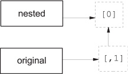
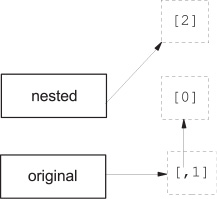
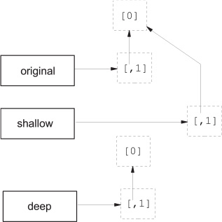

Lists, tuples, and sets
=============================


### *This lab covers*

-   [Manipulating lists and list indices]
-   [Modifying lists]
-   [Sorting]
-   [Using common list operations]
-   [Handling nested lists and deep copies]
-   [Using tuples]
-   [Creating and using sets]


### Lists are like arrays

A list in Python is much the same thing as an array in Java or C or any
other language; it's an ordered collection of objects. You create a list
by enclosing a comma-separated list of elements in square brackets, like
so:


```
# This assigns a three-element list to x
x = [1, 2, 3]
```


Note that you don't have to worry about declaring the list or fixing its
size ahead of time. This line creates the list as well as assigns it,
and a list automatically grows or shrinks as needed.


##### Arrays in Python


Unlike lists in many other languages, Python lists can contain different
types of elements; a list element can be any Python object. Here's a
list that contains a variety of elements:


```
# First element is a number, second is a string, third is another list.
x = [2, "two", [1, 2, 3]]
```


Probably the most basic built-in list function is the [len]
function, which returns the number of elements in a list:


```
>>> x = [2, "two", [1, 2, 3]]
>>> len(x)
3
```


Note that the [len] function doesn't count the items in the inner,
nested list.


##### Quick Check: len()


What would [len()] return for each of the following[: \[0\]; \[\];
\[\[1, 3, \[4, 5\], 6\], 7\]]?


### List indices


Understanding how list indices work will make Python much more useful to
you. Please read the whole section!


Elements can be extracted from a Python list by using a
notation like C's array indexing. Like C and many other languages,
Python starts counting from 0; asking for element 0 returns the first
element of the list, asking for element 1 returns the second element,
and so forth. Here are a few examples:


```
>>> x = ["first", "second", "third", "fourth"]
>>> x[0]
'first'
>>> x[2]
'third'
```


But Python indexing is more flexible than C indexing. If indices are
negative numbers, they indicate positions counting from the end of the
list, with --1 being the last position in the list, --2 being the
second-to-last position, and so forth. Continuing with the same list x,
you can do the following:


```
>>> a = x[-1]
>>> a
'fourth'
>>> x[-2]
'third'
```


For operations involving a single list index, it's generally
satisfactory to think of the index as pointing at a particular element
in the list. For more advanced operations, it's more correct to think of
list indices as indicating positions *between* elements. In the list
[\[\"first\", \"second\", \"third\", \"fourth\"\]], you can think
of the indices as pointing like this:


  x =\[                    \"first\",         \"second\",         \"third\",         \"fourth\"       \]
  ------------------ ----- ------------ ----- ------------- ----- ------------ ----- ------------ --- ----
  Positive indices   0                  1                   2                  3                       
  Negative indices   --4                --3                 --2                --1                     


This is irrelevant when you're extracting a single element, but Python
can extract or assign to an entire sublist at once---an operation known
as *slicing*. Instead of entering [list\[index\]] to extract the
item just after [index], enter [list\[index1:index2\]] to
extract all items including [index1] and up to (but not including)
[index2] into a new list. Here are some examples:


```
>>> x = ["first", "second", "third", "fourth"]
>>> x[1:-1]
['second', 'third']
>>> x[0:3]
['first', 'second', 'third']
>>> x[-2:-1]
['third']
```


It may seem reasonable that if the second
index indicates a position in the list *before* the first index, this
code would return the elements between those indices in reverse order,
but this isn't what happens. Instead, this code returns an empty list:


```
>>> x[-1:2]
[]
```


When slicing a list, it's also possible to leave out [index1] or
[index2]. Leaving out [index1] means "Go from the beginning
of the list," and leaving out [index2] means "Go to the end of the
list":


```
>>> x[:3]
['first', 'second', 'third']
>>> x[2:]
['third', 'fourth']
```


Omitting both indices makes a new list that goes from the beginning to
the end of the original list---that is, copies the list. This technique
is useful when you want to make a copy that you can modify without
affecting the original list:


```
>>> y = x[:]
>>> y[0] = '1 st'
>>> y
['1 st', 'second', 'third', 'fourth']
>>> x
['first', 'second', 'third', 'fourth']
```


##### Try this: List slices and indexes


Using what you know about the [len()] function and list slices,
how would you combine the two to get the second half of a list when you
don't know what size it is? Experiment in the Python shell to confirm
that your solution works.


### Modifying lists


You can use list index notation to modify a list as well as to extract
an element from it. Put the index on the left side of the assignment
operator:


```
>>> x = [1, 2, 3, 4]
>>> x[1] = "two"
>>> x
[1, 'two', 3, 4]
```


Slice notation can be used here too. Saying something like
[lista\[index1:index2\] = listb] causes all elements of
[lista] between [index1] and [index2] to be replaced
by the elements in [listb]. [listb] can have more or fewer
elements than are removed from [lista], in which case the length
of [lista] is altered. You can use slice assignment to do several
things, as shown here:


```
>>> x = [1, 2, 3, 4]
>>> x[len(x):] = [5, 6, 7]
>>> x
[1, 2, 3, 4, 5, 6, 7]
>>> x[:0] = [-1, 0]
>>> x
[-1, 0, 1, 2, 3, 4, 5, 6, 7]
>>> x[1:-1] = []
>>> x
[-1, 7]
```


Appending a single element to a list is such a common operation that
there's a special [append] method for it:


```
>>> x = [1, 2, 3]
>>> x.append("four")
>>> x
[1, 2, 3, 'four']
```


One problem can occur if you try to append one list to another. The list
gets appended as a single element of the main list:


```
>>> x = [1, 2, 3, 4]
>>> y = [5, 6, 7]
>>> x.append(y)
>>> x
[1, 2, 3, 4, [5, 6, 7]]
```


The [extend] method is like the [append] method except that
it allows you to add one list to another:


```
>>> x = [1, 2, 3, 4]
>>> y = [5, 6, 7]
>>> x.extend(y)
>>> x
[1, 2, 3, 4, 5, 6, 7]
```


There's also a special [insert] method to insert new list elements
between two existing elements or at the front of the list.
[insert] is used as a method of lists and takes two additional
arguments. The first additional argument is the index position in the
list where the new element should be inserted, and the second is the new
element itself:


```
>>> x = [1, 2, 3]
>>> x.insert(2, "hello")
>>> print(x)
[1, 2, 'hello', 3]
>>> x.insert(0, "start")
>>> print(x)
['start', 1, 2, 'hello', 3]
```


[insert] understands list indices as discussed in [section
5.2],
but for most uses, it's easiest to think of [list.insert(n, elem)]
as meaning [insert elem] just before the
*n*th element of list.
[insert] is just a convenience method. Anything that can be done
with [insert] can also be done with slice assignment. That is,
[list.insert(n, elem)] is the same thing as [list\[n:n\] =
\[elem\]] when [n] is nonnegative. Using [insert]
makes for somewhat more readable code, and [insert] even handles
negative indices:


```
>>> x = [1, 2, 3]
>>> x.insert(-1, "hello")
>>> print(x)
[1, 2, 'hello', 3]
```


The [del] statement is the preferred method of deleting list items
or slices. It doesn't do anything that can't be done with slice
assignment, but it's usually easier to remember and easier to read:


```
>>> x = ['a', 2, 'c', 7, 9, 11]
>>> del x[1]
>>> x
['a', 'c', 7, 9, 11]
>>> del x[:2]
>>> x
[7, 9, 11]
```


In general, [del list\[n\]] does the same thing as [list\[n:n+1\]
= \[\]], whereas [del list\[m:n\]] does the same thing as
[list\[m:n\] = \[\]].


The [remove] method isn't the converse of [insert]. Whereas
[insert] inserts an element at a specified location,
[remove] looks for the first instance of a given value in a list
and removes that value from the list:


```
>>> x = [1, 2, 3, 4, 3, 5]
>>> x.remove(3)
>>> x
[1, 2, 4, 3, 5]
>>> x.remove(3)
>>> x
[1, 2, 4, 5]
>>> x.remove(3)
Traceback (innermost last):
 File "<stdin>", line 1, in ?
ValueError: list.remove(x): x not in list
```


If [remove] can't find anything to remove, it raises an error. You
can catch this error by using the exception-handling abilities of
Python, or you can avoid the problem by using [in] to check for
the presence of something in a list before attempting to remove it.


The [reverse] method is a more specialized list modification
method. It efficiently reverses a list in place:


```
>>> x = [1, 3, 5, 6, 7]
>>> x.reverse()
>>> x
[7, 6, 5, 3, 1]
```


##### Try this: Modifying lists


Suppose
that you have a list 10 items long. How might you move the last three
items from the end of the list to the beginning, keeping them in the
same order?


### Sorting lists


Lists can be sorted by using the built-in Python [sort] method:


```
>>> x = [3, 8, 4, 0, 2, 1]
>>> x.sort()
>>> x
[0, 1, 2, 3, 4, 8]
```


This method does an in-place sort---that is, changes the list being
sorted. To sort a list without changing the original list, you have two
options. You can use the [sorted()] built-in function, discussed
in [section
5.4.2],
or you can make a copy of the list and sort the copy:


```
>>> x = [2, 4, 1, 3]
>>> y = x[:]
>>> y.sort()
>>> y
[1, 2, 3, 4]
>>> x
[2, 4, 1, 3]
```


Sorting works with strings, too:


```
>>> x = ["Life", "Is", "Enchanting"]
>>> x.sort()
>>> x
['Enchanting', 'Is', 'Life']
```


The [sort] method can sort just about anything because Python can
compare just about anything. But there's one caveat in sorting: The
default key method used by [sort] requires all items in the list
to be of comparable types. That means that using the [sort] method
on a list containing both numbers and strings raises an exception:


```
>>> x = [1, 2, 'hello', 3]
>>> x.sort()
Traceback (most recent call last):
  File "<stdin>", line 1, in <module>
TypeError: '<' not supported between instances of 'str' and 'int'
```


Conversely, you can sort a list of lists:


```
>>> x = [[3, 5], [2, 9], [2, 3], [4, 1], [3, 2]]
>>> x.sort()
>>> x
[[2, 3], [2, 9], [3, 2], [3, 5], [4, 1]]
```


According to the built-in Python rules for comparing complex objects,
the sublists are sorted first by ascending first element and then by
ascending second element.


[sort] is even more
flexible; it has an optional [reverse] parameter that causes the
sort to be in reverse order when [reverse=True], and it's possible
to use your own key function to determine how elements of a list are
sorted.


#### Custom sorting


For number-of-characters ordering, a suitable key function could be


```
def compare_num_of_chars(string1):
    return len(string1)
```


This key function is trivial. It passes the length of each string back
to the [sort] method, rather than the strings themselves.


After you define the key function, using it is a matter of passing it to
the [sort] method by using the [key] keyword. Because
functions are Python objects, they can be passed around like any other
Python objects. Here's a small program that illustrates the difference
between a default sort and your custom sort:


```
>>> def compare_num_of_chars(string1):
...     return len(string1)
>>> word_list = ['Python', 'is', 'better', 'than', 'C']
>>> word_list.sort()
>>> print(word_list)
['C', 'Python', 'better', 'is', 'than']
>>> word_list = ['Python', 'is', 'better', 'than', 'C']
>>> word_list.sort(key=compare_num_of_chars)
>>> print(word_list)
['C', 'is', 'than', 'Python', 'better']
```


The first list is in lexicographical order (with uppercase coming before
lowercase), and the second list is ordered by ascending number of
characters.


Custom sorting is very useful, but if performance is critical, it may be
slower than the default. Usually, this effect is minimal, but if the key
function is particularly complex, the effect may be more than desired,
especially for sorts involving hundreds of thousands or millions of
elements.


One particular place to avoid custom sorts is where you want to sort a
list in descending, rather than ascending, order. In this case, use the
[sort] method's
[reverse]
parameter set to [True]. If for some reason you don't want to do
that, it's still better to sort the list normally and then use the
[reverse] method to invert the order of the resulting list. These
two operations together---the standard sort and the reverse---will still
be much faster than a custom sort.


#### The sorted() function


Lists have a built-in method to sort themselves, but other iterables in
Python, such as the keys of a dictionary, don't have a [sort]
method. Python also has the built-in function [sorted()], which
returns a sorted list from any iterable. [sorted()] uses the same
[key] and [reverse] parameters as the sort method:


```
>>> x = (4, 3, 1, 2)
>>> y = sorted(x)
>>> y
[1, 2, 3, 4]
>>> z = sorted(x, reverse=True)
>>> z
[4, 3, 2, 1]
```


##### Try this: Sorting lists


Suppose that you have a list in which each element is in turn a list:
[\[\[1, 2, 3\], \[2, 1, 3\], \[4, 0, 1\]\]]. If you wanted to sort
this list by the second element in each list so that the result would be
[\[\[4, 0, 1\], \[2, 1, 3\], \[1, 2, 3\]\]], what function would
you write to pass as the [key] value to the [sort()] method?


### Other common list operations


Several other list methods are frequently useful, but they don't fall
into any specific category.


#### List membership with the in operator


It's easy to test whether a value is in a list by using the [in]
operator, which returns a Boolean value. You can also use the converse,
the [not in] operator:


```
>>> 3 in [1, 3, 4, 5]
True
>>> 3 not in [1, 3, 4, 5]
False
>>> 3 in ["one", "two", "three"]
False
>>> 3 not in ["one", "two", "three"]
True
```


#### List concatenation with the + operator


To create a list by concatenating two existing lists, use the [+]
(list concatenation) operator, which leaves the argument lists
unchanged:


```
>>> z = [1, 2, 3] + [4, 5]
>>> z
[1, 2, 3, 4, 5]
```


#### List initialization with the \* operator


Use
the [\*] operator to produce a list of a given size, which is
initialized to a given value. This operation is a common one for working
with large lists whose size is known ahead of time. Although you can use
[append] to add elements and automatically expand the list as
needed, you obtain greater efficiency by using [\*] to correctly
size the list at the start of the program. A list that doesn't change in
size doesn't incur any memory reallocation overhead:


```
>>> z = [None] * 4
>>> z
[None, None, None, None]
```


When used with lists in this manner, \* (which in this context is called
the *list multiplication operator*) replicates the given list the
indicated number of times and joins all the copies to form a new list.
This is the standard Python method for defining a list of a given size
ahead of time. A list containing a single instance of [None] is
commonly used in list multiplication, but the list can be anything:


```
>>> z = [3, 1] * 2
>>> z
[3, 1, 3, 1]
```


#### List minimum or maximum with min and max


You can use [min] and [max] to find the smallest and largest
elements in a list. You'll probably use [min] and [max]
mostly with numerical lists, but you can use them with lists containing
any type of element. Trying to find the maximum or minimum object in a
set of objects of different types causes an error if comparing those
types doesn't make sense:


```
>>> min([3, 7, 0, -2, 11])
-2
>>> max([4, "Hello", [1, 2]])
Traceback (most recent call last):
  File "<pyshell#58>", line 1, in <module>
    max([4, "Hello",[1, 2]])
TypeError: '>' not supported between instances of 'str' and 'int'
```


#### List search with index


If you want to find where in a list a value can be found (rather than
wanting to know only whether the value is in the list), use the
[index] method. This method searches through a list looking for a
list element equivalent to a given value and returns the position of
that list element:


```
>>> x = [1, 3, "five", 7, -2]
>>> x.index(7)
3
>>> x.index(5)
Traceback (innermost last):
 File "<stdin>", line 1, in ?
ValueError: 5 is not in list
```


Attempting to
find the position of an element that doesn't exist in the list raises an
error, as shown here. This error can be handled in the same manner as
the analogous error that can occur with the [remove] method (that
is, by testing the list with [in] before using [index]).


#### List matches with count


[count] also searches through a list, looking for a given value,
but it returns the number of times that the value is found in the list
rather than positional information:


```
>>> x = [1, 2, 2, 3, 5, 2, 5]
>>> x.count(2)
3
>>> x.count(5)
2
>>> x.count(4)
0
```


##### Quick Check: List Operations


What would be the result of len(\[\[1,2\]\] \* 3)?


What are two differences between using the [in] operator and a
list's [index()] method?


Which of the following will raise an exception?: [min(\[\"a\", \"b\",
\"c\"\])]; [max(\[1, 2, \"three\"\])]; [\[1, 2,
3\].count(\"one\")]


##### Try this: List operations


If you have a list [x], write the code to safely remove an item
if---and only if---that value is in the list.


Modify that code to remove the element only if the item occurs in the
list more than once.


### Nested lists and deep copies


This section covers another advanced topic that you may want to skip if
you're just learning the language.


Lists can be nested. One application of nesting is to represent
two-dimensional matrices. The members of these matrices can be referred
to by using two-dimensional indices. Indices for these matrices work as
follows:


```
>>> m = [[0, 1, 2], [10, 11, 12], [20, 21, 22]]
>>> m[0]
[0, 1, 2]
>>> m[0][1]
1
>>> m[2]
[20, 21, 22]
>>> m[2][2]
22
```


This mechanism scales to higher dimensions in the manner you'd expect.


Most of the time, this is all you need to concern yourself with. But you
may run into an issue with nested lists; specifically the way that
variables refer to objects and how some objects (such as lists) can be
modified (are mutable). An example is the best way to illustrate:


```
>>> nested = [0]
>>> original = [nested, 1]
>>> original
[[0], 1]
```


[Figure
5.1]
shows what this example looks like.


##### Figure 5.1. A list with its first item referring to a nested list




Now the value in the nested list can be changed by using either the
nested or the original variables:


```
>>> nested[0] = 'zero'
>>> original
[['zero'], 1]
>>> original[0][0] = 0
>>> nested
[0]
>>> original
[[0], 1]
```


But if [nested] is set to another list, the connection between
them is broken:


```
>>> nested = [2]
>>> original
[[0], 1]
```


[Figure
5.2]
illustrates this condition.


##### Figure 5.2. The first item of the original list is still a nested list, but the nested variable refers to a different list.




You've seen that you can obtain a copy of a list by taking a full slice
(that is, [x\[:\]]). You can also obtain a copy of a list by using
the [+] or \* operator (for example, [x + \[\]] or [x \*
1]). These techniques are slightly less efficient than the slice
method. All three create what is called a *shallow* copy of the list,
which is probably what you want most of the time. But if your list has
other lists nested in it, you may want to make a *deep* copy. You can do
this with the [deepcopy] function of the [copy] module:


```
>>> original = [[0], 1]
>>> shallow = original[:]
>>> import copy
>>> deep = copy.deepcopy(original)
```


See [figure
5.3]
for an illustration.


##### Figure 5.3. A shallow copy doesn't copy nested lists.




The lists pointed at by the original or shallow variables are connected.
Changing the value in the nested list through either one of them affects
the other:


```
>>> shallow[1] = 2
>>> shallow
[[0], 2]
>>> original
[[0], 1]
>>> shallow[0][0] = 'zero'
>>> original
[['zero'], 1]
```


The deep copy is independent of the original, and no
change to it has any effect on the original list:


```
>>> deep[0][0] = 5
>>> deep
[[5], 1]
>>> original
[['zero'], 1]
```


This behavior is the same for any other nested objects in a list that
are modifiable (such as dictionaries).


Now that you've seen what lists can do, it's time to look at tuples.


##### Try this: List copies


Suppose that you have the following list: [x = \[\[1, 2, 3\], \[4, 5,
6\], \[7, 8, 9\]\]] What code could you use to get a copy
[y] of that list in which you could change the elements *without*
the side effect of changing the contents of [x]?


### Tuples


*Tuples* are data structures that are very similar to lists, but they
can't be modified; they can only be created. Tuples are so much like
lists that you may wonder why Python bothers to include them. The reason
is that tuples have important roles that can't be efficiently filled by
lists, such as keys for dictionaries.


#### Tuple basics


Creating a tuple is similar to creating a list: assign a sequence of
values to a variable. A list is a sequence that's enclosed by [\[]
and [\]]; a tuple is a sequence that's enclosed by [(] and
[)]:


```
>>> x = ('a', 'b', 'c')
```


This line creates a three-element tuple.


After a tuple is created, using it is so much like using a list that
it's easy to forget that tuples and lists are different data types:


```
>>> x[2]
'c'
>>> x[1:]
('b', 'c')
>>> len(x)
3
>>> max(x)
'c'
>>> min(x)
'a'
>>> 5 in x
False
>>> 5 not in x
True
```


The main
difference between tuples and lists is that tuples are immutable. An
attempt to modify a tuple results in a confusing error message, which is
Python's way of saying that it doesn't know how to set an item in a
tuple:


```
>>> x[2] = 'd'
Traceback (most recent call last):
  File "<stdin>", line 1, in <module>
TypeError: 'tuple' object does not support item assignment
```


You can create tuples from existing ones by using the [+] and
[\*] operators:


```
>>> x + x
('a', 'b', 'c', 'a', 'b', 'c')
>>> 2 * x
('a', 'b', 'c', 'a', 'b', 'c')
```


A copy of a tuple can be made in any of the same ways as for lists:


```
>>> x[:]
('a', 'b', 'c')
>>> x * 1
('a', 'b', 'c')
>>> x + ()
('a', 'b', 'c')
```


If you didn't read [section
5.6],
you can skip the rest of this paragraph. Tuples themselves can't be
modified. But if they contain any mutable objects (for example, lists or
dictionaries), these objects may be changed if they're still assigned to
their own variables. Tuples that contain mutable objects aren't allowed
as keys for dictionaries.


#### One-element tuples need a comma


A small syntactical point is associated with using tuples. Because the
square brackets used to enclose a list aren't used elsewhere in Python,
it's clear that [\[\]] means an empty list and that [\[1\]]
means a list with one element. The same thing isn't true of the
parentheses used to enclose tuples. Parentheses can also be used to
group items in expressions to force a certain evaluation order. If you
say [(x + y)] in a Python program, do you mean that [x] and
[y] should be added and then put into a one-element tuple, or do
you mean that the parentheses should be used to force [x] and
[y] to be added before any expressions to either side come into
play?


This situation is a problem only for tuples with one element, because
tuples with more than one element always include commas to separate the
elements, and the commas tell Python that the parentheses indicate a
tuple, not a grouping. In the case of one-element tuples, Python
requires that the element in the tuple be followed by a comma, to
disambiguate the situation. In the case of zero-element (empty) tuples,
there's no problem. An empty set of parentheses must be a tuple because
it's meaningless otherwise:


```
>>> x = 3
>>> y = 4
>>> (x + y)   # This line adds x and y.
7
>>> (x + y,)  # Including a comma indicates that the parentheses denote a tuple.
(7,)
>>> ()        # To create an empty tuple, use an empty pair of parentheses.
()
```


#### Packing and unpacking tuples


As a
convenience, Python permits tuples to appear on the left side of an
assignment operator, in which case variables in the tuple receive the
corresponding values from the tuple on the right side of the assignment
operator. Here's a simple example:


```
>>> (one, two, three, four) =  (1, 2, 3, 4)
>>> one
1
>>> two
2
```


This example can be written even more simply, because Python recognizes
tuples in an assignment context even without the enclosing parentheses.
The values on the right side are packed into a tuple and then unpacked
into the variables on the left side:


```
one, two, three, four = 1, 2, 3, 4
```


One line of code has replaced the following four lines of code:


```
one = 1
two = 2
three = 3
four = 4
```


This technique is a convenient way to swap values between variables.
Instead of saying


```
temp = var1
var1 = var2
var2 = temp
```


simply say


```
var1, var2 = var2, var1
```


To make things even more convenient, Python 3 has an extended unpacking
feature, allowing an element marked with [\*] to absorb any number
of elements not matching the other elements. Again, some examples make
this feature clearer:


```
>>> x = (1, 2, 3, 4)
>>> a, b, *c = x
>>> a, b, c
(1, 2, [3, 4])
>>> a, *b, c = x
>>> a, b, c
(1, [2, 3], 4)
>>> *a, b, c = x
>>> a, b, c
([1, 2], 3, 4)
>>> a, b, c, d, *e = x
>>> a, b, c, d, e
(1, 2, 3, 4, [])
```


Note
that the starred element receives all the surplus items as a list and
that if there are no surplus elements, the starred element receives an
empty list.


Packing and unpacking can also be performed by using list delimiters:


```
>>> [a, b] = [1, 2]
>>> [c, d] = 3, 4
>>> [e, f] = (5, 6)
>>> (g, h) = 7, 8
>>> i, j = [9, 10]
>>> k, l = (11, 12)
>>> a
1
>>> [b, c, d]
[2, 3, 4]
>>> (e, f, g)
(5, 6, 7)
>>> h, i, j, k, l
(8, 9, 10, 11, 12)
```


#### Converting between lists and tuples


Tuples can be easily converted to lists with the [list] function,
which takes any sequence as an argument and produces a new list with the
same elements as the original sequence. Similarly, lists can be
converted to tuples with the [tuple] function, which does the same
thing but produces a new tuple instead of a new list:


```
>>> list((1, 2, 3, 4))
[1, 2, 3, 4]
>>> tuple([1, 2, 3, 4])
(1, 2, 3, 4)
```


As an interesting side note, [list] is a convenient way to break a
string into characters:


```
>>> list("Hello")
['H', 'e', 'l', 'l', 'o']
```


This technique works because [list] (and [tuple]) apply to
any Python sequence, and a string is just a sequence of characters.


##### Quick Check: Tuples


Explain why the following operations aren't legal for the tuple [x = (1,
2, 3, 4):]


```
x.append(1)
x[1] = "hello"
del x[2]
```


If you had a tuple [x = (3, 1, 4, 2)], how might you end up with
[x] sorted?


#### Set operations

In addition to the operations that apply to collections in general, such
as [in], [len], and iteration in [for] loops, sets
have several set-specific operations:


```
>>> x = set([1, 2, 3, 1, 3, 5])     1
>>> x
{1, 2, 3, 5}                        2
>>> x.add(6)                        3
>>> x
{1, 2, 3, 5, 6}
>>> x.remove(5)                     4
>>> x
{1, 2, 3, 6}
>>> 1 in x                          5
True
>>> 4 in x                          5
False
>>> y = set([1, 7, 8, 9])
>>> x | y                           6
{1, 2, 3, 6, 7, 8, 9}
>>> x & y                           7
{1}
>>> x ^ y                           8
{2, 3, 6, 7, 8, 9}
>>>
```


You can create a set by using [set] on a sequence, such as a list
***1***. When a sequence is made into a set, duplicates are removed
***2***. After creating a set by using the [set] function, you can
use [add] ***3*** and [remove] ***4*** to change the
elements in the set. The [in] keyword is used to check for
membership of an object in a set ***5***. You can also use [\|]
***6*** to get the union, or combination, of two sets, [&] to get
their intersection ***7***, and [\^] ***8*** to find their
symmetric difference---that is, elements that are in one set or the
other but not both.


These examples aren't a complete listing of set operations but are
enough to give you a good idea of how sets work. For more information,
refer to the official Python documentation.


#### Frozensets


Because sets aren't immutable and hashable, they can't belong to other
sets. To remedy that situation, Python has another set type,
[frozenset], which is just like a set but can't be changed after
creation. Because frozensets are immutable and hashable, they can be
members of other sets:


```
>>> x = set([1, 2, 3, 1, 3, 5])
>>> z = frozenset(x)
>>> z
frozenset({1, 2, 3, 5})
>>> z.add(6)
Traceback (most recent call last):
  File "<pyshell#79>", line 1, in <module>
    z.add(6)
AttributeError: 'frozenset' object has no attribute 'add'
>>> x.add(z)
>>> x
{1, 2, 3, 5, frozenset({1, 2, 3, 5})}
```


##### Quick Check: Sets


If you were to construct a set from the following list, how many
elements would the set have?: [\[1, 2, 5, 1, 0, 2, 3, 1, 1, (1, 2,
3)\]]


##### Lab 5: Examining a List


In this lab, the task is to read a set of temperature data (the monthly
high temperatures at Heathrow Airport for 1948 through 2016) from a file
and then find some basic information: the highest and lowest
temperatures, the mean (average) temperature, and the median temperature
(the temperature in the middle if all the temperatures are sorted).


The temperature data is in the file lab\_05.txt in the source code
directory for this lab. Because I haven't yet discussed reading
files, here's the code to read the files into a list:


```
temperatures = []
with open('lab_05.txt') as infile:
     for row in infile:
        temperatures.append(int(row.strip())
```


You should find the highest and lowest temperature, the average, and the
median. You'll probably want to use the [min(), max(), sum(),
len(),] and [sort()] functions/methods.


##### Bonus


Determine how many unique temperatures are in the list.


### Summary


-   [Lists and tuples are structures that embody the idea of a sequence
    of elements, as are strings.]
-   [Lists are like arrays in other languages, but with automatic
    resizing, slice notation, and many convenience functions.]
-   [Tuples are like lists but can't be modified, so they use less
    memory and can be dictionary keys.