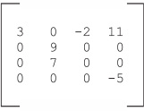

Dictionaries
=======================


### *This lab covers*

-   [Defining a dictionary]
-   [Using dictionary operations]
-   [Determining what can be used as a key]
-   [Creating sparse matrices]
-   [Using dictionaries as caches]
-   [Trusting the efficiency of dictionaries]


This lab discusses dictionaries, Python's name for associative
arrays or maps, which it implements by using hash tables. Dictionaries
are amazingly useful, even in simple programs.


In spite of the differences between them, the use of dictionaries and
lists often appears to be the same. As a start, an empty dictionary is
created much like an empty list, but with curly braces instead of square
brackets:


```
>>> x = []
>>> y = {}
```


Here, the first line creates a new, empty list and assigns it to
[x]. The second line creates a new, empty dictionary and assigns
it to [y].


After you create a dictionary, you may store values in it as though it
were a list:


```
>>> y[0] = 'Hello'
>>> y[1] = 'Goodbye'
```


Even in these assignments, there's already a significant operational
difference between the dictionary and list usage. Trying to do the same
thing with a list would result in an error, because in Python, it's
illegal to assign to a position in a list that doesn't exist. For
example, if you try to assign to the *0*th element of the list
[x], you receive an error:


```
>>> x[0] = 'Hello'
Traceback (innermost last):
  File "<stdin>", line 1, in ?
IndexError: list assignment index out of range
```


This isn't a problem with dictionaries; new positions in
dictionaries are created as necessary.


Having stored some values in the dictionary, now you can access and use
them:


```
>>> print(y[0])
Hello
>>> y[1] + ", Friend."
'Goodbye, Friend.'
```


All in all, this makes a dictionary look pretty much like a list. Now
for the big difference. Store (and use) some values under keys that
aren't integers:


```
>>> y["two"] = 2
>>> y["pi"] = 3.14
>>> y["two"] * y["pi"]
6.28
```


This is definitely something that can't be done with lists! Whereas list
indices must be integers, dictionary keys are much less restricted; they
may be numbers, strings, or one of a wide range of other Python objects.
This makes dictionaries a natural for jobs that lists can't do. For
example, it makes more sense to implement a telephone-directory
application with dictionaries than with lists because the phone number
for a person can be stored indexed by that person's last name.


A dictionary is a way of mapping from one set of arbitrary objects to an
associated but equally arbitrary set of objects. Actual dictionaries,
thesauri, or translation books are good analogies in the real world. To
see how natural this correspondence is, here's the start of an
English-to-French color translator:


```
>>> english_to_french = {}
>>> english_to_french['red'] = 'rouge'
>>> english_to_french['blue'] = 'bleu'
>>> english_to_french['green'] = 'vert'
>>> print("red is", english_to_french['red'])
red is rouge
```


##### Try this: Create a dictionary


Write the code to ask the user for three names and three ages. After the
names and ages are entered, ask the user for one of the names, and print
the correct age.


### Other dictionary operations


Besides basic element assignment and access, dictionaries support
several operations. You can define a dictionary explicitly as a series
of key-value pairs separated by commas:


```
>>> english_to_french = {'red': 'rouge', 'blue': 'bleu', 'green': 'vert'}
```


[len] returns the number of entries in a dictionary:


```
>>> len(english_to_french)
3
```


You can obtain all the keys in
the dictionary with the [keys] method. This method is often used
to iterate over the contents of a dictionary using Python's [for]
loop:


```
>>> list(english_to_french.keys())
['green', 'blue', 'red']
```


In Python 3.5 and earlier, the order of the keys in a list returned by
[keys] has no meaning; the keys aren't necessarily sorted, and
they don't necessarily occur in the order in which they were created.
Your Python code may print out the keys in a different order than my
Python code did. If you need keys sorted, you can store them in a list
variable and then sort that list. However, starting with Python 3.6,
dictionaries preserve the order that the keys were created and return
them in that order.


It's also possible to obtain all the values stored in a dictionary by
using [values]:


```
>>> list(english_to_french.values())
 ['vert', 'bleu', 'rouge']
```


This method isn't used nearly as often as [keys].


You can use the [items] method to return all keys and their
associated values as a sequence of tuples:


```
>>> list(english_to_french.items())
[('green', 'vert'), ('blue', 'bleu'), ('red', 'rouge')]
```


Like [keys], this method is often used in conjunction with a
[for] loop to iterate over the contents of a dictionary.


The [del] statement can be used to remove an entry (key-value
pair) from a dictionary:


```
>>> list(english_to_french.items())
[('green', 'vert'), ('blue', 'bleu'), ('red', 'rouge')]
>>> del english_to_french['green']
>>> list(english_to_french.items())
 [('blue', 'bleu'), ('red', 'rouge')]
```


##### Dictionary view objects


The [keys], [values], and [items] methods return not
lists, but *views* that behave like sequences but are dynamically
updated whenever the dictionary changes. That's why you need to use the
[list] function to make them appear as a list in these examples.
Otherwise, they behave like sequences, allowing code to iterate over
them in a [for] loop, using [in] to check membership in
them, and so on.


The view returned by [keys] (and in some cases the view returned
by [items]) also behaves like a set, with union, difference, and
intersection operations.


Attempting to
access a key that isn't in a dictionary is an error in Python. To handle
this error, you can test the dictionary for the presence of a key with
the [in] keyword, which returns [True] if a dictionary has a
value stored under the given key and [False] otherwise:


```
>>> 'red' in english_to_french
True
>>> 'orange' in english_to_french
False
```


Alternatively, you can use the [get] function. This function
returns the value associated with a key if the dictionary contains that
key, but returns its second argument if the dictionary doesn't contain
the key:


```
>>> print(english_to_french.get('blue', 'No translation'))
bleu
>>> print(english_to_french.get('chartreuse', 'No translation'))
No translation
```


The second argument is optional. If that argument isn't included,
[get] returns [None] if the dictionary doesn't contain the
key.


Similarly, if you want to safely get a key's value *and* make sure that
it's set to a default in the dictionary, you can use the
[setdefault] method:


```
>>> print(english_to_french.setdefault('chartreuse', 'No translation'))
No translation
```


The difference between [get] and [setdefault] is that after
the [setdefault] call, there's a key in the dictionary
[\'chartreuse\'] with the value [\'No translation\'].


You can obtain a copy of a dictionary by using the [copy] method:


```
>>> x = {0: 'zero', 1: 'one'}
>>> y = x.copy()
>>> y
{0: 'zero', 1: 'one'}
```


This method makes a shallow copy of the dictionary, which is likely to
be all you need in most situations. For dictionaries that contain any
modifiable objects as values (for example, lists or other dictionaries),
you may want to make a deep copy by using the [copy.deepcopy]
function.


The [update] method updates a first dictionary with all the
key-value pairs of a second dictionary. For keys that are common to both
dictionaries, the values from the second dictionary override those of
the first:


```
>>> z = {1: 'One', 2: 'Two'}
>>> x = {0: 'zero', 1: 'one'}
>>> x.update(z)
>>> x
{0: 'zero', 1: 'One', 2: 'Two'}
```


##### Quick Check: Dictionary operations


Assume that you have a dictionary [x = {\'a\':1, \'b\':2, \'c\':3,
\'d\':4}] and a dictionary [y = {\'a\':6, \'e\':5,
\'f\':6}]. What would be the contents of x after the following
snippets of code have executed?:


```
del x['d']
z = x.setdefault('g', 7)
x.update(y)
```


### Word counting


Assume that you have a file that contains a list of words, one word per
line. You want to know how many times each word occurs in the file. You
can use dictionaries to perform this task easily:


```
>>> sample_string = "To be or not to be"
>>> occurrences = {}
>>> for word in sample_string.split():
...     occurrences[word] = occurrences.get(word, 0) + 1       1
...
>>> for word in occurrences:
...     print("The word", word, "occurs", occurrences[word], \
...            "times in the string")
...
The word To occurs 1 times in the string
The word be occurs 2 times in the string
The word or occurs 1 times in the string
The word not occurs 1 times in the string
The word to occurs 1 times in the string
```


Increment the
[occurrences] count for each word ***1***. This is a good example
of the power of dictionaries. The code is simple, but because dictionary
operations are highly optimized in Python, it's also quite fast. This
pattern is so handy, in fact, that it's been standardized as the
[Counter] class in the [collections] module of the standard
library.


### What can be used as a key?


The previous examples use strings as keys, but Python permits more than
just strings to be used in this manner. Any Python object that is
immutable and hashable can be used as a key to a dictionary.


In Python, as discussed earlier, any object that can be modified is
called *mutable*. Lists are mutable because list elements can be added,
changed, or removed. Dictionaries are also mutable for the same reason.
Numbers are immutable. If a variable [x] is referring to the
number 3, and you assign 4 to [x], you've made [x] refer to
a different number (4), but you haven't changed the number 3 itself; 3
still has to be 3. Strings are also immutable. [list\[n\]] returns
the *n*th element of [list], [string\[n\]] returns the *n*th
character of [string], and [list\[n\] = value] changes the
*n*th element of [list], but [string\[n\] = character] is
illegal in Python and causes an error, because strings in Python are
immutable.


Unfortunately, the requirement that keys be immutable and hashable means
that lists can't be used as dictionary keys, but in many instances, it
would be convenient to have a listlike key. For example, it's convenient
to store information about a person under a key consisting of the
person's first and last names, which you could easily do if you could
use a two-element list as a key.


Python solves this difficulty by providing tuples, which are basically
immutable lists; they're created and used similarly to lists, except
that once created, they can't be modified. There's one further
restriction: Keys must also be hashable, which takes things a step
further than just immutable. To be hashable, a value must have a hash
value (provided by a [\_\_hash\_\_] method) that never changes
throughout the life of the value. That means that tuples containing
mutable values are *not* hashable, although the tuples themselves are
technically immutable. Only tuples that don't contain any mutable
objects nested within them are hashable and valid to use as keys for
dictionaries. 


The next sections give examples illustrating how tuples and dictionaries
can work together.


##### Quick Check: What can be a key?


Decide which of the following expressions can be a dictionary key[: 1;
\'bob\'; (\'tom\', \[1, 2, 3\]); \[\"filename\"\]; \"filename\";
(\"filename\", \"extension\")]


### Sparse matrices


In mathematical terms, a *matrix* is a two-dimensional grid of numbers,
usually written in textbooks as a grid with square brackets on each
side, as shown here.


A fairly standard way to represent such a matrix is by means of a list
of lists. In Python, a matrix is presented like this:


```
matrix = [[3, 0, -2, 11], [0, 9, 0, 0], [0, 7, 0, 0], [0, 0, 0, -5]]
```





Elements in the matrix can be accessed by row and column number:


```
element = matrix[rownum][colnum]
```


But in some applications, such as weather forecasting, it's common for
matrices to be very large---thousands of elements to a side, meaning
millions of elements in total. It's also common for such matrices to
contain many zero elements. In some applications, all but a small
percentage of the matrix elements may be set to zero. To conserve
memory, it's common for such matrices to be stored in a form in which
only the nonzero elements are actually stored. Such representations are
called *sparse matrices*.


It's simple to implement sparse matrices by
using dictionaries with tuple indices. For example, the previous sparse
matrix can be represented as follows:


```
matrix = {(0, 0): 3, (0, 2): -2, (0, 3): 11,
          (1, 1): 9, (2, 1): 7, (3, 3): -5}
```


Now you can access an individual matrix element at a given row and
column number by this bit of code:


```
if (rownum, colnum) in matrix:
    element = matrix[(rownum, colnum)]
else:
    element = 0
```


A slightly less clear (but more efficient) way of doing this is to use
the dictionary [get] method, which you can tell to return
[0] if it can't find a key in the dictionary and otherwise return
the value associated with that key, preventing one of the dictionary
lookups:


```
element = matrix.get((rownum, colnum), 0)
```


If you're considering doing extensive work with matrices, you may want
to look into [NumPy], the numeric computation package.


### Dictionaries as caches


This section shows how dictionaries can be used as *caches*, data
structures that store results to avoid recalculating those results over
and over. Suppose that you need a function called [sole], which
takes three integers as arguments and returns a result. The function
might look something like this:


```
def sole(m, n, t):
    # . . . do some time-consuming calculations . . .
    return(result)
```


But if this function is very time-consuming, and if it's called tens of
thousands of times, the program might run too slowly.


Now suppose that [sole] is called with about 200 different
combinations of arguments during any program run. That is, you might
call [sole(12, 20, 6)] 50 or more times during the execution of
your program and similarly for many other combinations of arguments. By
eliminating the recalculation of [sole] on identical arguments,
you'd save a huge amount of time. You could use a dictionary with tuples
as keys, like so:


```
sole_cache = {}
def sole(m, n, t):
    if (m, n, t) in sole_cache:
        return sole_cache[(m, n, t)]
    else:
        # . . . do some time-consuming calculations . . .
        sole_cache[(m, n, t)] = result
        return result
```


The rewritten [sole] function uses a
global variable to store previous results. The global variable is a
dictionary, and the keys of the dictionary are tuples corresponding to
argument combinations that have been given to [sole] in the past.
Then any time [sole] passes an argument combination for which a
result has already been calculated, it returns that stored result rather
than recalculating it.


##### Try this: Using dictionaries


Suppose that you're writing a program that works like a spreadsheet. How
might you use a dictionary to store the contents of a sheet? Write some
sample code to both store a value and retrieve a value in a particular
cell. What might be some drawbacks to this approach?


##### Lab 7: Word Counting


In the previous lab, you took the text of the first chapter of *Moby
Dick*, normalized the case, removed punctuation, and wrote the separated
words to a file. In this lab, you read that file, use a dictionary to
count the number of times each word occurs, and then report the most
common and least common words.


### Summary


-   [Dictionaries are powerful data structures, used for many purposes
    even within Python itself.]
-   [Dictionary keys must be immutable, but any immutable object can be
    a dictionary key.]
-   [Using keys means accessing collections of data more directly and
    with less code than many other solutions.]

