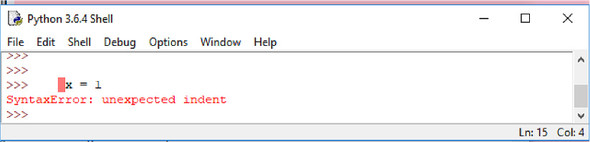

Control flow
=======================


### *This lab covers*

-   [Repeating code with a [while] loop]
-   [Making decisions: the [if-elif-else] statement]
-   [Iterating over a list with a [for] loop]
-   [Using list and dictionary comprehensions]
-   [Delimiting statements and blocks with indentation]
-   [Evaluating Boolean values and expressions]


Python provides a complete set of control-flow elements, with loops and
conditionals. This lab examines each element in detail.


### The if-elif-else statement


The most general form of the if-then-else construct in Python is


```
if condition1:
    body1
elif condition2:
    body2
elif condition3:
    body3
.
.
.
elif condition(n-1):
    body(n-1)


else:
    body(n)
```


It says: If [condition1]
is [True], execute [body1]; otherwise, if [condition2]
is [True], execute [body2]; otherwise . . . and so on until
it either finds a condition that evaluates to [True] or hits the
[else] clause, in which case it executes [body(n)]. As with
the [while] loop, the [body] sections are again sequences of
one or more Python statements that are separated by newlines and are at
the same level of indentation.


You don't need all that luggage for every conditional, of course. You
can leave out the [elif] parts, the [else] part, or both. If
a conditional can't find any body to execute (no conditions evaluate to
[True], and there's no [else] part), it does nothing.


The [body] after the [if] statement is required. But you can
use the [pass] statement here (as you can anywhere in Python where
a statement is required). The [pass] statement serves as a
placeholder where a statement is needed, but it performs no action:


```
if x < 5:
    pass
else:
    x = 5
```


There's no case (or switch) statement in Python.


##### Where's the case statement in Python?


As just mentioned, there's no case statement in Python. In most cases
where a case or switch statement would be used in other languages,
Python gets by just fine with a ladder of if\... elif\... elif\... else.
In the few cases where that gets cumbersome, a dictionary of functions
usually works, as in this example:


```
def do_a_stuff():
    #process a
def do_b_stuff():
    #process b
def do_c_stiff():
    #process c

func_dict = {'a' : do_a_stuff,
             'b' : do_b_stuff,
             'c' : do_c_stuff }

x = 'a'
func_dict[x]()         1
```


-   [***1* run function from dictionary**]


In fact, there have been proposals (see PEP 275 and PEP 3103) to add a
case statement to Python, but overall consensus has been that it's not
needed or worth the trouble.


### The for loop


This small loop prints out the reciprocal of each number in [x]:


```
x = [1.0, 2.0, 3.0]
for n in x:
    print(1 / n)
```


#### The range function


Sometimes, you need to loop with explicit indices (such as the positions
at which values occur in a list). You can use the [range] command
together with the [len] command on the list to generate a sequence
of indices for use by the [for] loop. This code prints out all the
positions in a list where it finds negative numbers:


```
x = [1, 3, -7, 4, 9, -5, 4]
for i in range(len(x)):
    if x[i] < 0:
        print("Found a negative number at index ", i)
```


#### Controlling range with starting and stepping values


You can use two variants on the [range] function to gain more
control over the sequence it produces. If you use [range] with two
numeric arguments, the first argument is the
starting
number for the resulting sequence, and the second number is the number
the resulting sequence goes up to (but doesn't include). Here are a few
examples:


```
>>> list(range(3, 7))           1
[3, 4, 5, 6]
>>> list(range(2, 10))          1
[2, 3, 4, 5, 6, 7, 8, 9]
>>> list(range(5, 3))
[]
```


[list()] is used only to force the items [range] would
generate to appear as a list. It's not normally used in actual code
***1***.


This still doesn't allow you to count backward, which is why the value
of [list(range(5, 3))] is an empty list. To count backward, or to
count by any amount other than 1, you need to use the optional third
argument to [range], which gives a step value by which counting
proceeds:


```
>>> list(range(0, 10, 2))
[0, 2, 4, 6, 8]
>>> list(range(5, 0, -1))
[5, 4, 3, 2, 1]
```


Sequences returned by [range] always include the starting value
given as an argument to [range] and never include the ending value
given as an argument.


#### Using break and continue in for loops


The two special statements [break] and [continue] can also
be used in the body of a [for] loop. If [break] is executed,
it immediately terminates the [for] loop, and not even the
[post-code] (if there is an [else] clause) is executed. If
[continue] is executed in a [for] loop, it causes the
remainder of the [body] to be skipped over, and the loop proceeds
as normal with the next item.


#### The for loop and tuple unpacking


You can use tuple unpacking to make some [for] loops cleaner. The
following code takes a list of two-element tuples and calculates the
value of the sum of the products of the two numbers in each tuple (a
moderately common mathematical operation in some fields):


```
somelist = [(1, 2), (3, 7), (9, 5)]
result = 0
for t in somelist:
    result = result + (t[0] * t[1])
```


Here's the same thing, but cleaner:


```
somelist = [(1, 2), (3, 7), (9, 5)]
result = 0

for x, y in somelist:
    result = result + (x * y)
```


This
code uses a tuple [x, y] immediately after the [for] keyword
instead of the usual single variable. On each iteration of the
[for] loop, [x] contains element [0] of the current
tuple from [list], and [y] contains element [1] of the
current tuple from [list]. Using a tuple in this manner is a
convenience of Python, and doing this indicates to Python that each
element of the list is expected to be a tuple of appropriate size to
unpack into the variable names mentioned in the tuple after the
[for].


#### The enumerate function


You can combine tuple unpacking with the [enumerate] function to
loop over both the items and their index. This is similar to using
[range] but has the advantage that the code is clearer and easier
to understand. Like the previous example, the following code prints out
all the positions in a list where it finds negative numbers:


```
x = [1, 3, -7, 4, 9, -5, 4]
for i, n in enumerate(x):                                1
    if n < 0:                                            2
        print("Found a negative number at index ", i)    3
```


The [enumerate] function returns tuples of (index, item) ***1***.
You can access the item without the index ***2***. The index is also
available ***3***.


#### The zip function


Sometimes, it's useful to combine two or more iterables before looping
over them. The [zip] function takes the corresponding elements
from one or more iterables and combines them into tuples until it
reaches the end of the shortest iterable:

```
>>> x = [1, 2, 3, 4]
>>> y = ['a', 'b', 'c']
>>> z = zip(x, y)
>>> list(z)
[(1, 'a'), (2, 'b'), (3, 'c')]
```


##### Try this: Looping and if statements


Suppose that you have a list [x = \[1, 3, 5, 0, -1, 3, -2\]], and
you need to remove all negative numbers from that list. Write the code
to do this.


How would you count the total number of negative numbers in a list [y =
\[\[1, -1, 0\], \[2, 5, -9\], \[-2, -3, 0\]\]]?


What code would you use to print [very low] if the value of
[x] is below -5, [low] if it's from -5 up to 0,
[neutral] if it's equal to 0, [high] if it's greater than 0
up to 5, and [very high] if it's greater than 5?


### List and dictionary comprehensions


The pattern of using a [for] loop to iterate through
a list, modify or select individual elements, and create a new list or
dictionary is very common. Such loops often look a lot like the
following:


```
>>> x = [1, 2, 3, 4]
>>> x_squared = []
>>> for item in x:
...     x_squared.append(item * item)
...
>>> x_squared
[1, 4, 9, 16]
```


This sort of situation is so common that Python has a special shortcut
for such operations, called a *comprehension*. You can think of a list
or dictionary comprehension as a one-line [for] loop that creates
a new list or dictionary from a sequence. The pattern of a list
comprehension is as follows:


```
new_list = [expression1 for variable in old_list if expression2]
```


and a dictionary comprehension looks like this:


```
new_dict = {expression1:expression2 for variable in list if expression3}
```


In both cases, the heart of the expression is similar to the beginning
of a [for] loop---[for variable in list]---with some
expression using that variable to create a new key or value and an
optional conditional expression using the value of the variable to
select whether it's included in the new list or dictionary. The
following code does exactly the same thing as the previous code but is a
list comprehension:


```
>>> x = [1, 2, 3, 4]
>>> x_squared = [item * item for item in x]
>>> x_squared
[1, 4, 9, 16]
```


You can even use [if] statements to select items from the list:


```
>>> x = [1, 2, 3, 4]
>>> x_squared = [item * item for item in x if item > 2]

>>> x_squared
[9, 16]
```


Dictionary comprehensions are similar, but you need to supply both a key
and a value. If you want to do something similar to the previous example
but have the number be the key and the number's square be the value in a
dictionary, you can use a dictionary comprehension, like so:


```
>>> x = [1, 2, 3, 4]
>>> x_squared_dict = {item: item * item for item in x}
>>> x_squared_dict
{1: 1, 2: 4, 3: 9, 4: 16}
```


List
and dictionary comprehensions are very flexible and powerful, and when
you get used to them, they make list-processing operations much simpler.
I recommend that you experiment with them and try them any time you find
yourself writing a [for] loop to process a list of items.


#### Generator expressions


Generator expressions are similar to list comprehensions. A generator
expression looks a lot like a list comprehension, except that in place
of square brackets, it uses parentheses. The following example is the
generator-expression version of the list comprehension already
discussed:


```
>>> x = [1, 2, 3, 4]
>>> x_squared = (item * item for item in x)
>>> x_squared
<generator object <genexpr> at 0x102176708>
>>> for square in x_squared:
...     print(square,)
...
1 4 9 16
```


Other than the change from square brackets, notice that this expression
doesn't return a list. Instead, it returns a generator object that could
be used as the iterator in a [for] loop, as shown, which is very
similar to what the [range()] function does. The advantage of
using a generator expression is that the entire list isn't generated in
memory, so arbitrarily large sequences can be generated with little
memory overhead.


##### Try this: Comprehensions


What list comprehension would you use to process the list [x] so
that all negative values are removed?


Create a generator that returns only odd numbers from 1 to 100. (Hint: A
number is odd if there is a remainder if divided by 2; use [% 2]
to get the remainder of division by 2.)


Write the code to create a dictionary of the numbers and their cubes
from 11 through 15.


### Statements, blocks, and indentation


Because the control flow constructs you've encountered in this lab
are the first to make use of blocks and indentation, this is a good time
to revisit the subject.


Python uses the indentation of the statements to determine the
delimitation of the different blocks (or bodies) of the control-flow
constructs. A block consists of one or more statements, which are
usually separated by newlines. Examples of Python statements are the
assignment statement, function calls, the [print] function, the
placeholder [pass] statement, and the [del] statement. The
control-flow constructs ([if-elif-else], [while], and
[for] loops) are compound statements:


```
compound statement clause:
    block
compound statement clause:
    block
```


A compound statement contains one or more clauses that are each followed
by indented blocks. Compound statements can appear in blocks just like
any other statements. When they do, they create nested blocks.


You may also encounter a couple of special cases. Multiple statements
may be placed on the same line if they're separated by semicolons. A
block containing a single line may be placed on the same line after the
semicolon of a clause of a compound statement:


```
>>> x = 1; y = 0; z = 0
>>> if x > 0: y = 1; z = 10
... else: y = -1
...
>>> print(x, y, z)
1 1 10
```


Improperly indented code results in an exception being raised. You may
encounter two forms of this exception. The first is


```
>>>
>>>   x = 1
File "<stdin>", line 1
    x = 1
    ^
   IndentationError: unexpected indent
>>>
```


This code indented a line that shouldn't have been indented. In the
basic mode, the carat ([\^]) indicates the spot where the problem
occurred. In the IDLE Python shell (see [figure
8.1]),
the invalid indent is highlighted. The same message would occur if the
code didn't indent where necessary (that is, the first line after a
compound statement clause).


##### Figure 8.1. Indentation error




One situation where this can occur can be confusing. If you're using an
editor that displays tabs in four-space increments (or Windows
interactive mode, which indents the first tab only four spaces from the
prompt) and indent one line with four spaces and then the next line with
a tab, the two lines may appear to be at the same level of indentation.
But you receive this exception because Python maps the tab to eight
spaces. The best way to avoid this problem is to use only spaces in
Python code. If you must use tabs for indentation, or if you're dealing
with code that uses tabs, be sure never to mix them with spaces.


On the subject of the basic interactive mode and the IDLE Python shell,
you've likely noticed that you need an extra line after the outermost
level of indentation:


```
>>> x = 1
>>> if x == 1:
...    y = 2
...    if v > 0:
...        z = 2
...        v = 0
...
>>> x = 2
```


No line is necessary after the line [z = 2], but one is needed
after the line [v = 0]. This line is unnecessary if you're placing
your code in a module in a file.


The second form of exception occurs if you indent a statement in a block
less than the legal amount:


```
>>> x = 1
>>> if x == 1:
           y = 2
        z = 2
File "<stdin>", line 3
       z = 2
       ^
    IndentationError: unindent does not match any outer indentation level
```


In this example, the line containing [z = 2] isn't lined up
properly below the line containing [y = 2]. This form is rare, but
I mention it again because in a similar situation, it may be confusing.


Python allows you to indent any amount and won't complain regardless of
how much you vary indentation as long as you're consistent within a
single block. Please don't take improper advantage of this flexibility.
The recommended standard is to use four spaces for each level of
indentation.


Before leaving indentation, I'll cover breaking up statements across
multiple lines, which of course is necessary more often as the level of
indentation increases. You can explicitly break up a line by using the
backslash character. You can also implicitly break any statement between
tokens when within a set of [()], [{}], or [\[\]]
delimiters (that is, when typing a set of values in a list, a tuple, or
a dictionary; a set of arguments in a function call; or any expression
within a set of brackets). You can indent the continuation line of a
statement to any level you desire:


```
>>> print('string1', 'string2', 'string3' \
...    , 'string4', 'string5')
string1 string2 string3 string4 string5
>>> x = 100 + 200 + 300 \
...    + 400 + 500
>>> x
1500
>>> v = [100, 300, 500, 700, 900,
...    1100, 1300]
>>> v
[100, 300, 500, 700, 900, 1100, 1300]
>>> max(1000, 300, 500,
...        800, 1200)
1200
>>> x = (100 + 200 + 300
...          + 400 + 500)
>>> x
1500
```


You
can break a string with a [\\] as well. But any indentation tabs
or spaces become part of the string, and the line *must* end with the
[\\]. To avoid this situation, remember that any string literals
separated by whitespace are automatically concatenated by the Python
interpreter:


```
>>> "strings separated by whitespace "    \
...    """are automatically"""  ' concatenated'
'strings separated by whitespace are automatically concatenated'
>>> x = 1
>>> if x > 0:
...        string1 = "this string broken by a backslash will end up \
...                with the indentation tabs in it"
...
>>> string1
'this string broken by a backslash will end up \t\t\twith
     the indentation tabs in it'
>>> if x > 0:
...        string1 = "this can be easily avoided by splitting the " \
...            "string in this way"
...
>>> string1
'this can be easily avoided by splitting the string in this way'
```


### Boolean values and expressions


The previous examples of control flow use conditional tests in a fairly
obvious manner but never really explain what constitutes true or false
in Python or what expressions can be used where a conditional test is
needed. This section describes these aspects of Python.


Python has a Boolean object type that can be set to either [True]
or [False]. Any expression with a Boolean operation returns
[True] or [False].


#### Most Python objects can be used as Booleans


In
addition, Python is similar to C with respect to Boolean values, in that
C uses the integer [0] to mean false and any other integer to mean
true. Python generalizes this idea: [0] or empty values are
[False], and any other values are [True]. In practical
terms, this means the following:


-   [The numbers [0], [0.0], and [0+0j] are all
    [False]; any other number is [True].]
-   [The empty string [\"\"] is [False]; any other string is
    [True].]
-   [The empty list [\[\]] is [False]; any other list is
    [True].]
-   [The empty dictionary [{}] is [False]; any other
    dictionary is [True].]
-   [The empty set [set()] is [False]; any other set is
    [True].]
-   [The special Python value [None] is always
    [False].]


We haven't looked at some Python data structures yet, but generally, the
same rule applies. If the data structure is empty or [0], it's
taken to mean false in a Boolean context; otherwise, it's taken to mean
true. Some objects, such as file objects and code objects, don't have a
sensible definition of a [0] or empty element, and these objects
shouldn't be used in a Boolean context.


#### Comparison and Boolean operators


You can compare objects by using normal operators: [\<],
[\<=], [\>], [\>=], and so forth. [==] is the
equality test operator, and[!=] is the "not equal to" test. There
are also [in] and [not in] operators to test membership in
sequences (lists, tuples, strings, and dictionaries), as well as
[is] and [is not] operators to test whether two objects are
the same.


Expressions that return a Boolean value may be combined into more
complex expressions using the [and], [or], and [not]
operators. This code snippet checks to see whether a variable is within
a certain range:


```
if 0 < x and x < 10:
    ...
```


Python offers a nice shorthand for this particular type of compound
statement. You can write it as you would in a math paper:


```
if 0 < x < 10:
    ...
```


Various rules of precedence apply; when in doubt, you can use
parentheses to make sure that Python interprets an expression the way
you want it to. Using parentheses is probably a good idea for complex
expressions, regardless of whether it's necessary, because it makes
clear to future maintainers of the code exactly what's happening. See
the Python documentation for more details on precedence.


The rest of this section provides more advanced information. If you're
reading this course as you're learning the language, you may want to skip
that material for now.


The [and]
and [or] operators return objects. The [and] operator
returns either the first false object (that an expression evaluates to)
or the last object. Similarly, the [or] operator returns either
the first true object or the last object. This may seem a little
confusing, but it works correctly; if an expression with [and] has
even one false element, that element makes the entire expression
evaluate as [False], and that [False] value is returned. If
all of the elements are [True], the expression is [True],
and the last value, which must also be [True,] is returned. The
converse is true for [or]; only one [True] element makes the
statement logically [True], and the first [True] value found
is returned. If no [True] values are found, the last
([False]) value is returned. In other words, as with many other
languages, evaluation stops as soon as a true expression is found for
the [or] operator or as soon as a false expression is found for
the [and] operator:


```
>>> [2] and [3, 4]
[3, 4]
>>> [] and 5
[]
>>> [2] or [3, 4]
[2]
>>> [] or 5
5
>>>
```


The [==] and[!=] operators test to see whether their
operands contains the same values. [==] and [!=] are used in
most situations, as opposed to [is] and [is not] operators,
which test to see whether their operands are the same object:


```
>>> x = [0]
>>> y = [x, 1]
>>> x is y[0]
True
>>> x = [0]
>>> x is y[0]
False
>>> x == y[0]
True
```


Revisit [section
5.6],
"[Nested lists and deep
copies],"
if this example isn't clear to you.


##### Quick Check: Booleans and truthiness


Decide whether the following statements are true or false: [1, 0, -1,
\[0\], 1 and 0, 1 \> 0 or \[\].]


### Writing a simple program to analyze a text file


To give you a better sense of how a Python program works, this section
looks at a small sample that roughly replicates the UNIX [wc]
utility and reports the number of lines, words, and characters in a
file. The sample in this listing is deliberately written to be clear to
programmers who are new to Python and to be as simple as possible.


##### Listing: word\_count.py


```
#!/usr/bin/env python3

""" Reads a file and returns the number of lines, words,
    and characters - similar to the UNIX wc utility
"""

infile = open('word_count.tst')

lines = infile.read().split("\n")

line_count = len(lines)

word_count = 0
char_count = 0

for line in lines:

    words = line.split()
    word_count += len(words)

    char_count += len(line)

print("File has {0} lines, {1} words, {2} characters".format
                             (line_count, word_count, char_count))
```


To test, you can run this sample against a sample file containing the
first paragraph of this lab's summary, like this.


##### Listing: word\_count.tst


```
Python provides a complete set of control flow elements,
including while and for loops, and conditionals.
Python uses the level of indentation to group blocks
of code with control elements.
```


Upon running word\_count.py, you get the following output:


```
naomi@mac:~/pythonjourney/code $ python3 word_count.py
File has 4 lines, 30 words, 189 characters
```


This code can give you an idea of a Python program. There isn't much
code, and most of the work gets done in three lines of code in the
[for] loop. In fact, this program could be made even shorter and
more idiomatic. Most Pythonistas see this conciseness as one of Python's
great strengths.


##### Lab 8: Refactor word\_count


Rewrite the word-count program from [section
8.7]
to make it shorter. You may want to look at the string and list
operations already discussed, as well as think about different ways to
organize the code. You may also want to make the program smarter so that
only alphabetic strings (not symbols or punctuation) count as words.


### Summary


-   [Python uses indentation to group blocks of code.]
-   [Python has loops using [while] and [for], and
    conditionals using [if-elif-else].]
-   [Python has the Boolean values [True] and [False], which
    can be referenced by variables.]
-   [Python also considers any 0 or empty value to be [False] and
    any nonzero or nonempty value to be [True].]
