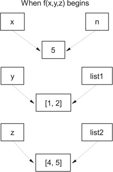
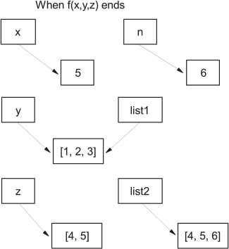

Functions
====================


### *This lab covers*

-   [Defining functions]
-   [Using function parameters]
-   [Passing mutable objects as parameters]
-   [Understanding local and global variables]
-   [Creating and using generator functions]
-   [Creating and using lambda expressions]
-   [Using decorators]


This lab assumes that you're familiar with function definitions in
at least one other computer language and with the concepts that
correspond to function definitions, arguments, parameters, and so forth.


### Basic function definitions


As it does with control
structures, Python uses indentation to delimit the body of the function
definition. The following simple example puts the factorial code from a
previous section into a function body, so you can call a [fact]
function to obtain the factorial of a number:


```
>>> def fact(n):
...     """Return the factorial of the given number."""    1
...     r = 1
...     while n > 0:
...         r = r * n
...         n = n - 1
...     return r                                           2
...
```


The second line ***1*** is an optional *documentation string,* or
*docstring.* You can obtain its value by printing
[fact.\_\_doc\_\_]. The intention of docstrings is to describe the
external behavior of a function and the parameters it takes, whereas
comments should document internal information about how the code works.
Docstrings are strings that immediately follow the first line of a
function definition and are usually triple quoted to allow for multiline
descriptions. Browsing tools are available that extract the first line
of document strings. It's standard practice for multiline documentation
strings to give a synopsis of the function in the first line, follow
this synopsis with a blank second line, and end with the rest of the
information. This line indicates that the value after the return is sent
back to the code calling the function ***2***.


##### Procedure or function?


Although all Python functions return values, it's up to you whether a
function's return value is used:


```
>>> fact(4)            1
24                     2
>>> x = fact(4)        3
>>> x
24
>>>
```


The return value isn't associated with a variable ***1***. The
[fact] function's value is printed in the interpreter only
***2***. The return value is associated with the variable [x]
***3***.


#### Positional parameters


The simplest way to pass parameters to a function in Python is by
position. In the first line of the function, you specify variable names
for each parameter; when the function is called, the parameters used in
the calling code are matched to the function's parameter variables based
on their order. The following function computes [x] to the power
of [y]:


```
>>> def power(x, y):
...     r = 1
...     while y > 0:
...         r = r * x
...         y = y - 1
...     return r
...
>>> power(3, 3)
27
```


This method requires that the number of parameters used by the calling
code exactly matches the number of parameters in the function
definition; otherwise, a [TypeError] exception is raised:


```
>>> power(3)
Traceback (most recent call last):
  File "<stdin>", line 1, in <module>
TypeError: power() missing 1 required positional argument: 'y'
>>>
```


##### Default values


Function parameters can have default values, which you declare by
assigning a default value in the first line of the function definition,
like so:


```
def fun(arg1, arg2=default2, arg3=default3, . . .)
```


Any number of parameters can be given default values. Parameters with
default values must be defined as the last ones in the parameter list
because Python, like most languages, pairs arguments with parameters on
a positional basis. There must be enough arguments to a function that
the last parameter in that function's parameter list without a default
value gets an argument. See [section
9.2.2],
"[Passing arguments by parameter
name],"
for a more flexible mechanism.


The following
function also computes [x] to the power of [y]. But if
[y] isn't given in a call to the function, the default value of 2
is used, and the function is just the square function:


```
>>> def power(x, y=2):
...     r = 1
...     while y > 0:
...         r = r * x
...         y = y - 1
...     return r
...
```


You can see the effect of the default argument in the following
interactive session:


```
>>> power(3, 3)
27
>>> power(3)
9
```


#### Passing arguments by parameter name


You can also pass arguments into a function by using the name of the
corresponding function parameter rather than its position. Continuing
with the previous interactive example, you can type


```
>>> power(2, 3)
8
>>> power(3, 2)
9
>>> power(y=2, x=3)
9
```


Because the arguments to [power] in the final invocation are
named, their order is irrelevant; the arguments are associated with the
parameters of the same name in the definition of [power], and you
get back [3\^2]. This type of argument passing is called *keyword*
*passing.*


Keyword passing, in combination with the default argument capability of
Python functions, can be highly useful when you're defining functions
with large numbers of possible arguments, most of which have common
defaults. Consider a function that's intended to produce a list with
information about files in the current directory and that uses Boolean
arguments to indicate whether that list should include information such
as file size, last modified date, and so forth, for each file. You can
define such a function along these lines


```
def list_file_info(size=False, create_date=False, mod_date=False, ...):
    ...get file names...
    if size:
        # code to get file sizes goes here
    if create_date:
        # code to get create dates goes here
    # do any other stuff desired

    return fileinfostructure
```


and
then call it from other code using keyword argument passing to indicate
that you want only certain information (in this example, the file size
and modification date but *not* the creation date):


```
fileinfo = list_file_info(size=True, mod_date=True)
```


This type of argument handling is particularly suited for functions with
very complex behavior, and one place where such functions occur is in a
graphical user interface (GUI). If you ever use the Tkinter package to
build GUIs in Python, you'll find that the use of optional,
keyword-named arguments like this is invaluable.


#### Variable numbers of arguments


Python functions can also be defined to handle variable numbers of
arguments, which you can do in two ways. One way handles the relatively
familiar case in which you want to collect an unknown number of
arguments at the end of the argument list into a list. The other method
can collect an arbitrary number of keyword-passed arguments, which have
no correspondingly named parameter in the function parameter list, into
a dictionary. These two mechanisms are discussed next.


##### Dealing with an indefinite number of positional arguments


Prefixing the final parameter name of the function with a [\*]
causes all excess non-keyword arguments in a call of a function (that
is, those positional arguments not assigned to another parameter) to be
collected together and assigned as a tuple to the given parameter.
Here's a simple way to implement a function to find the maximum in a
list of numbers.


First, implement the function:


```
>>> def maximum(*numbers):
...     if len(numbers) == 0:
...         return None
...     else:
...         maxnum = numbers[0]
...         for n in numbers[1:]:
...             if n > maxnum:
...                 maxnum = n
...         return maxnum
...
```


Now test the behavior of the function:


```
>>> maximum(3, 2, 8)
8
>>> maximum(1, 5, 9, -2, 2)
9
```


##### Dealing with an indefinite number of arguments passed by keyword


An arbitrary number of keyword arguments can also be handled. If the
final parameter in the parameter list is prefixed with [\*\*], it
collects all excess *keyword-passed* arguments into a dictionary. The
key for each entry in the dictionary is the keyword
(parameter
name) for the excess argument. The value of that entry is the argument
itself. An argument passed by keyword is excess in this context if the
keyword by which it was passed doesn't match one of the parameter names
in the function definition.


For example:


```
>>> def example_fun(x, y, **other):
...     print("x: {0}, y: {1}, keys in 'other': {2}".format(x,
...           y, list(other.keys())))
...     other_total = 0
...     for k in other.keys():
...         other_total = other_total + other[k]
...     print("The total of values in 'other' is {0}".format(other_total))
```


Trying out this function in an interactive session reveals that it can
handle arguments passed in under the keywords [foo] and
[bar], even though [foo] and [bar] aren't parameter
names in the function definition:


```
>>> example_fun(2, y="1", foo=3, bar=4)
x: 2, y: 1, keys in 'other': ['foo', 'bar']
The total of values in 'other' is 7
```


#### Mixing argument-passing techniques


It's possible to use all of the argument-passing features of Python
functions at the same time, although it can be confusing if not done
with care. The general rule for using mixed argument-passing is that
positional arguments come first, then named arguments, followed by the
indefinite positional argument with a single \*, and last of all the
indefinite keyword argument with \*\*. See the documentation for full
details.


##### Quick Check: Functions and parameters


How would you write a function that could take any number of unnamed
arguments and print their values out in reverse order?


What do you need to do to create a procedure or void function---that is,
a function with no return value?


What happens if you capture the return value of a function with a
variable?


### Mutable objects as arguments


Arguments are passed in by object reference. The parameter becomes a new
reference to the object. For immutable objects (such as tuples, strings,
and numbers), what is done with a parameter has no effect outside the
function. But if you pass in a mutable object (such as a list,
dictionary, or class instance), any change made to the object changes
what the argument is referencing outside the function. Reassigning the
parameter doesn't affect the argument, as shown in [figures
9.1]
and
[9.2]:


```
>>> def f(n, list1, list2):
...    list1.append(3)
...    list2 = [4, 5, 6]
...    n = n + 1
...
>>> x = 5
>>> y = [1, 2]
>>> z = [4, 5]
>>> f(x, y, z)
>>> x, y, z
(5, [1, 2, 3], [4, 5])
```


[Figures
9.1]
and
[9.2]
illustrate what happens when function [f] is called. The variable
[x] isn't changed because it's immutable. Instead, the function
parameter [n] is set to refer to the new value of 6. Likewise,
variable [z] is unchanged because inside function [f], its
corresponding parameter [list2] was set to refer to a new object,
[\[4, 5, 6\]]. Only [y] sees a change because the actual
list it points to was changed.


##### Figure 9.1. At the beginning of function [f()], both the initial variables and the function parameters refer to the same objects.




##### Figure 9.2. At the end of function [f(),y (list1] inside the function) has been changed internally, whereas [n] and [list2] refer to different objects.




##### Quick Check: Mutable function parameters


What would be the result of changing a list or dictionary that was
passed into a function as a parameter value? Which operations would be
likely to create changes that would be visible outside the function?
What steps might you take to minimize that risk?


### Local, nonlocal, and global variables


Here, you return to the definition of [fact] from the beginning of
this lab:


```
def fact(n):
    """Return the factorial of the given number."""
    r = 1
    while n > 0:
        r = r * n
        n = n - 1
    return r
```


Both the variables [r] and [n] are *local* to any particular
call of the factorial function; changes to them made when the function
is executing have no effect on any variables outside the
function. Any variables in the parameter list of a function, and any
variables created within a function by an assignment (like [r = 1]
in [fact]), are local to the function.


You can explicitly make a variable global by declaring it so before the
variable is used, using the [global] statement. Global variables
can be accessed and changed by the function. They exist outside the
function and can also be accessed and changed by other functions that
declare them global or by code that's not within a function. Here's an
example that shows the difference between local and global variables:


```
>>> def fun():
...     global a
...     a = 1
...     b = 2
...
```


This example defines a function that treats [a] as a global
variable and [b] as a local variable, and attempts to modify both
[a] and [b].


Now test this function:


```
>>> a = "one"
>>> b = "two"

>>> fun()
>>> a
1
>>> b
'two'
```


The assignment to [a] within [fun] is an assignment to the
global variable [a] also existing outside [fun]. Because
[a] is designated [global] in [fun], the assignment
modifies that global variable to hold the value [1] instead of the
value [\"one\"]. The same isn't true for [b]; the local
variable called [b] inside [fun] starts out referring to the
same value as the variable [b] outside [fun], but the
assignment causes [b] to point to a new value that's local to the
function [fun].


##### Listing: File nonlocal.py


```
g_var = 0
nl_var = 0
print("top level-> g_var: {0} nl_var: {1}".format(g_var, nl_var))
def test():
    nl_var = 2
    print("in test-> g_var: {0} nl_var: {1}".format(g_var, nl_var))
    def inner_test():

        global g_var
        nonlocal nl_var
        g_var = 1
        nl_var = 4
        print("in inner_test-> g_var: {0} nl_var: {1}".format(g_var,
                                                              nl_var))

    inner_test()
    print("in test-> g_var: {0} nl_var: {1}".format(g_var, nl_var))

test()
print("top level-> g_var: {0} nl_var: {1}".format(g_var, nl_var))
```


When run, this code prints the following:


```
top level-> g_var: 0 nl_var: 0
in test-> g_var: 0 nl_var: 2
in inner_test-> g_var: 1 nl_var: 4
in test-> g_var: 1 nl_var: 4
top level-> g_var: 1 nl_var: 0
```


Note that the value of the top-level [nl\_var] hasn't been
affected, which would happen if [inner\_test] contained the line
[global nl\_var].


The bottom line is that if you want to assign to a variable existing
outside a function, you must explicitly declare that variable to be
nonlocal or global. But if you're accessing a variable that exists
outside the function, you don't need to declare it nonlocal or global.
If Python can't find a variable name in the local function scope, it
attempts to look up the name in the global scope. Hence, accesses to
global variables are automatically sent through to the correct global
variable. Personally, I don't recommend using this shortcut. It's much
clearer to a reader if all global variables are explicitly declared as
global. Further, you probably want to limit the use of global variables
within functions to rare occasions.

##### Try this: Global vs. local variables


Assuming that [x = 5], what will be the value of [x] after
[funct\_1()] below executes? After [funct\_2()] executes?


```
def funct_1():
    x = 3
def funct_2():
    global x
    x = 2
```


### Assigning functions to variables


Functions can be assigned, like other Python objects, to variables, as
shown in this example:


```
>>> def f_to_kelvin(degrees_f):
...     return 273.15 + (degrees_f - 32) * 5 / 9
...
>>> def c_to_kelvin(degrees_c):
...     return 273.15 + degrees_c
...
>>> abs_temperature = f_to_kelvin
>>> abs_temperature(32)
273.15
>>> abs_temperature = c_to_kelvin
>>> abs_temperature(0)
273.15
```


You can place functions in lists, tuples, or dictionaries:


```
>>> t = {'FtoK': f_to_kelvin, 'CtoK': c_to_kelvin}
>>> t['FtoK'](32)
273.15
>>> t['CtoK'](0)
273.15
```


A variable that refers to a function can be used in exactly the same way
as the function ***1***. This last example shows how you can use a
dictionary to call different functions by the value of the strings used
as keys. This pattern is common in situations in which different
functions need to be selected based on a string value, and in many
cases, it takes the place of the [switch] structure found in
languages such as C and Java.


### lambda expressions


Short functions like those you just saw can also be defined by using
[lambda] expressions of the form


```
lambda parameter1, parameter2, . . .: expression
```


[lambda] expressions are anonymous little functions that you can
quickly define inline. Often, a small function needs to be passed to
another function, like the key function used by a list's sort method. In
such cases, a large function is usually unnecessary, and it would be
awkward to have to define the function in a separate place from where
it's used. The dictionary in the previous subsection can be defined all
in one place with


```
>>> t2 = {'FtoK': lambda deg_f: 273.15 + (deg_f - 32) * 5 / 9,
...       'CtoK': lambda deg_c: 273.15 + deg_c}                  1
>>> t2['FtoK'](32)
273.15
```


This example defines [lambda]
expressions as values of the dictionary ***1***. Note that
[lambda] expressions don't have a [return] statement because
the value of the expression is automatically returned.


### Generator functions


A *generator* function is a special kind of function that you can use to
define your own iterators. When you define a generator function, you
return each iteration's value using the [yield] keyword. The
generator will stop returning values when there are no more iterations,
or it encounters either an empty [return] statement or the end of
the function. Local variables in a generator function are saved from one
call to the next, unlike in normal functions:

```
>>> def four():
...     x = 0
...     while x < 4:
...         print("in generator, x =", x)
...         yield x
...         x += 1
...
>>> for i in four():
...     print(i)
...
in generator, x = 0
0
in generator, x = 1
1
in generator, x = 2
2
in generator, x = 3
3
```


Note that this generator function has a [while] loop that limits
the number of times the generator executes. Depending on how it's used,
a generator that doesn't have some condition to halt it could cause an
endless loop when called.


##### yield vs. yield from


Starting with Python 3.3, the new key word for generators, [yield
from], joins [yield]. Basically, [yield from] makes it
possible to string generators together. [yield from] behaves the
same way as [yield], except that it delegates the generator
machinery to a subgenerator. So in a simple case, you could do this:


```
>>> def subgen(x):
...     for i in range(x):
...         yield i
...
>>> def gen(y):
...     yield from subgen(y)
...
>>> for q in gen(6):
...     print(q)
...
0
1
2
3
4
5
```


This example allows the
[yield] expression to be moved out of the main generator, making
refactoring easier.


You can also use generator functions with [in] to see whether a
value is in the series that the generator produces:


```
>>> 2 in four()
in generator, x = 0
in generator, x = 1
in generator, x = 2
True
>>> 5 in four()
in generator, x = 0
in generator, x = 1
in generator, x = 2
in generator, x = 3
False
```


### Decorators

It's possible, for example, to write a Python function that takes
another function as its parameter, wraps it in another function that
does something related, and then returns the new function. This new
combination can be used instead of the original function:


```
>>> def decorate(func):
...     print("in decorate function, decorating", func.__name__)
...     def wrapper_func(*args):
...         print("Executing", func.__name__)
...         return func(*args)
...     return wrapper_func
...
>>> def myfunction(parameter):
...     print(parameter)
...
>>> myfunction = decorate(myfunction)
in decorate function, decorating myfunction
>>> myfunction("hello")
Executing myfunction
hello
```


Very simply, using a decorator involves two parts: defining the function
that will be wrapping or "decorating" other functions and then using an
[@] followed by the decorator immediately before the wrapped
function is defined. The decorator function should take a function as a
parameter and return a function, as follows:


```
>>> def decorate(func):
...     print("in decorate function, decorating", func.__name__)     1
...     def wrapper_func(*args):
...         print("Executing", func.__name__)
...         return func(*args)
...     return wrapper_func                                          2
...
>>> @decorate                                                        3
... def myfunction(parameter):
...     print(parameter)
...
in decorate function, decorating myfunction                          4
>>> myfunction("hello")
Executing myfunction
hello
```


The [decorate] function prints the name of the function it's
wrapping when the function is defined ***1***. When it's finished, the
decorator returns the wrapped function ***2***. [myfunction] is
decorated using [\@decorate] ***3***. The wrapped function is
called after the decorator function has completed ***4***.


Using a decorator to wrap one function in another can be handy for
several purposes. In web frameworks such as Django, decorators are used
to make sure that a user is logged in before executing a function; and
in graphics libraries, decorators can be used to register a function
with the graphics framework.


##### Try this: Decorators


How would you modify the code for the decorator function to remove
unneeded messages and enclose the return value of the wrapped function
in [\"\<html\>\"] and [\"\</html\>\"], so that [myfunction
(\"hello\")] would return [\"\<html\>hello\<html\>\"]?


##### Lab 9: Useful functions


Looking back at the previous labs,
refactor that code into functions for cleaning and processing the data.
The goal should be that most of the logic is moved into functions. Use
your own judgment as to the types of functions and parameters, but keep
in mind that functions should do just one thing, and they shouldn't have
any side effects that carry over outside the function.


### Summary


-   [External variables can easily be accessed within a function by
    using the [global] statement.]
-   [Arguments may be passed by position or by parameter name.]
-   [Default values may be provided for function parameters.]
-   [Functions can collect arguments into tuples, giving you the ability
    to define functions that take an indefinite number of
    arguments.]
-   [Functions can collect arguments into dictionaries, giving you the
    ability to define functions that take an indefinite number of
    arguments passed by parameter name.]
-   [Functions are first-class objects in Python, which means that they
    can be assigned to variables, accessed by way of variables, and
    decorated.]
