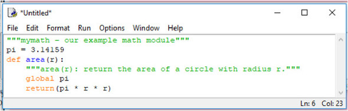
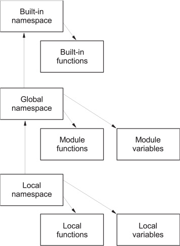

Modules and scoping rules 
=====================================


### *This lab covers:*

-   [Defining a module]
-   [Writing a first module]
-   [Using the [import] statement]
-   [Modifying the module search path]
-   [Making names private in modules]
-   [Importing standard library and third-party modules]
-   [Understanding Python scoping rules and namespaces]


Modules are used to organize larger Python projects. The Python standard
library is split into modules to make it more manageable. You don't need
to organize your own code into modules, but if you're writing any
programs that are more than a few pages long or any code that you want
to reuse, you should probably do so.


### What is a module?


A *module* is a file containing code. It defines a group of Python
functions or other objects, and the name of the module is derived from
the name of the file.


Modules most often contain Python source
code, but they can also be compiled C or C++ object files. Compiled
modules and Python source modules are used the same way.


As well as grouping related Python objects, modules help avert
name-clash problems. You might write a module for your program called
[mymodule], which defines a function called [reverse]. In
the same program, you might also want to use somebody else's module
called [othermodule], which also defines a function called
[reverse] but does something different from your [reverse]
function. In a language without modules, it would be impossible to use
two different functions named [reverse]. In Python, the process is
trivial; you refer to the functions in your main program as
[mymodule.reverse] and [othermodule.reverse].


Using the module names keeps the two [reverse] functions straight
because Python uses namespaces. A *namespace* is essentially a
dictionary of the identifiers available to a block, function, class,
module, and so on. I discuss namespaces a bit more at the end of this
chapter, but be aware that each module has its own namespace, which
helps prevent naming conflicts.


Modules are also used to make Python itself more manageable. Most
standard Python functions aren't built into the core of the language but
are provided via specific modules, which you can load as needed.


### A first module


The best way to learn about modules is probably to make one, so you get
started in this section.


Create a text file called mymath.py, and in that text file, enter the
Python code in [listing
10.1].
(If you're using IDLE, choose File \> New Window and start typing, as
shown in [figure
10.1]


##### Listing: File mymath.py


```
"""mymath - our example math module"""
pi = 3.14159
def area(r):
    """area(r): return the area of a circle with radius r."""
    global pi
    return(pi * r * r)
```


##### Figure 10.1. An IDLE edit window provides the same editing functionality as the shell window, including automatic indentation and colorization.




Save this code for now in the
directory where your Python executable is. This code merely assigns
[pi] a value and defines a function. The .py filename suffix is
strongly suggested for all Python code files; it identifies that file to
the Python interpreter as consisting of Python source code. As with
functions, you have the option of putting in a document string as the
first line of your module.


Now start up the Python shell and type the following:


```
>>> pi
Traceback (innermost last):
  File "<stdin>", line 1, in ?
NameError: name 'pi' is not defined
>>> area(2)
Traceback (innermost last):
  File "<stdin>", line 1, in ?
NameError: name 'area' is not defined
```


In other words, Python doesn't have the constant [pi] or the
function [area] built in.


Now type


```
>>> import mymath
>>> pi
Traceback (innermost last):
  File "<stdin>", line 1, in ?
NameError: name 'pi' is not defined
>>> mymath.pi
3.14159
>>> mymath.area(2)
12.56636
>>> mymath.__doc__
'mymath - our example math module'
>>> mymath.area.__doc__
'area(r): return the area of a circle with radius r.'
```


You've brought in the definitions for [pi] and [area] from
the mymath.py file, using the [import] statement (which
automatically adds the .py suffix when it searches for the file defining
the module named [mymath]). But the new definitions aren't
directly accessible; typing [pi] by itself gave an error, and
typing [area(2)] by itself would give an error. Instead, you
access [pi] and [area] by *prepending* them with the name of
the module that contains them, which guarantees name safety. Another
module out there may also define [pi] (maybe the author of that
module thinks that pi is 3.14 or 3.14159265), but that module is of no
concern. Even if that other module is imported, its version of
[pi] will be accessed by [othermodulename.pi], which is
different from [mymath.pi]. This form of access is often referred
to as *qualification* (that is, the variable [pi] is being
qualified by the module [mymath]). You may also refer to
[pi] as an *attribute* of [mymath].


Definitions within a module can access other definitions within that
module without prepending the module name. The [mymath.area]
function accesses the [mymath.pi] constant as just [pi].


If you want to, you can also specifically ask for names
from a module to be imported in such a manner that you don't have to
prepend them with the module name. Type


```
>>> from mymath import pi
>>> pi
3.14159
>>> area(2)
Traceback (innermost last):
  File "<stdin>", line 1, in ?
NameError: name 'area' is not defined
```


The name [pi] is now directly accessible because you specifically
requested it by using [from mymath import pi]. The function
[area] still needs to be called as [mymath .area], though,
because it wasn't explicitly imported.


You may want to use the basic interactive mode or IDLE's Python shell to
incrementally test a module as you're creating it. But if you change
your module on disk, retyping the [import] command won't cause it
to load again. You need to use the [reload] function from the
[importlib] module for this purpose. The [importlib] module
provides an interface to the mechanisms behind importing modules:


```
>>> import mymath, importlib
>>> importlib.reload(mymath)
<module 'mymath' from '/home/doc/pythonjourney/code/mymath.py'>
```


When a module is reloaded (or imported for the first time), all of its
code is parsed. A syntax exception is raised if an error is found. On
the other hand, if everything is okay, a .pyc file (for example,
mymath.pyc) containing Python byte code is created.


Reloading a module doesn't put you back into exactly the same situation
as when you start a new session and import it for the first time. But
the differences won't normally cause you any problems. If you're
interested, you can look up [reload] in the section on the
[importlib] module in the *Python Language Reference,* found at
<https://docs.python.org/3/reference/import.html> in this page's
importlib section, to find the details.


Modules don't need to be used only from the interactive Python shell, of
course. You can also import them into scripts (or other modules, for
that matter); enter suitable [import] statements at the beginning
of your program file. Internally to Python, the interactive session and
a script are considered to be modules as well.


To summarize:


-   [A module is a file defining Python objects.]
-   [If the name of the module file is modulename.py, the Python name of
    the module is [modulename].]
-   [You can bring a module named [modulename] into use with the
    [import modulename] statement. After this statement is
    executed, objects defined in the module can be accessed as
    [modulename.objectname].]
-   [Specific names from a module can be
    brought directly into your program by using the [from modulename
    import objectname] statement. This statement makes
    [objectname] accessible to your program without your needing
    to prepend it with [modulename], and it's useful for bringing
    in names that are often used.]


### The import statement


The [import] statement takes three different forms. The most basic
is


```
import modulename
```


which searches for a Python module of the given name, parses its
contents, and makes it available. The importing code can use the
contents of the module, but any references by that code to names within
the module must still be prepended with the module name. If the named
module isn't found, an error is generated. I discuss exactly where
Python looks for modules in [section
10.4].


The second form permits specific names from a module to be explicitly
imported into the code:


```
from modulename import name1, name2, name3, . . .
```


Each of [name1], [name2], and so forth from within
[modulename] is made available to the importing code; code after
the [import] statement can use any of [name1],
[name2], [name3], and so on without your prepending the
module name.


Finally, there's a general form of the [from . . . import . . .]
statement:


```
from modulename import *
```


The [\*] stands for all the exported names in [modulename].
[from modulename import \*] imports all public names from
[modulename]---that is, those that don't begin with an
underscore---and makes them available to the importing code without the
necessity of prepending the module name. But if a list of names called
[\_\_all\_\_] exists in the module (or the package's
\_\_init\_\_.py), the names are the ones imported, whether or not they
begin with an underscore.


You should take care when using this particular form of importing. If
two modules both define a name, and you import both modules using this
form of importing, you'll end up with a name clash, and the name from
the second module will replace the name from the first. This technique
also makes it more difficult for readers of your code to determine where
the names you're using originate. When you use either of the two
previous forms of the import statement, you give your reader explicit
information about where they're from.


But some modules (such as [tkinter]) name their functions to make
it obvious where they originate and to make it unlikely that name
clashes will occur. It's also common to use the general import to save
keystrokes when using an interactive shell.


### The module search path


Exactly
where Python looks for modules is defined in a variable called
[path], which you can access through a module called [sys].
Enter the following:


```
>>> import sys
>>> sys.path
_list of directories in the search path_
```


The value shown in place of [\_list of directories in the search
path\_] depends on the configuration of your system. Regardless of
the details, the string indicates a list of directories that Python
searches (in order) when attempting to execute an [import]
statement. The first module found that satisfies the [import]
request is used. If there's no satisfactory module in the module search
path, an [ImportError] exception is raised.


If you're using IDLE, you can graphically look at the search path and
the modules on it by using the Path Browser window, which you can start
from the File menu of the Python shell window.


The [sys.path] variable is initialized from the value of the
environment (operating system) variable [PYTHONPATH], if it
exists, or from a default value that's dependent on your installation.
In addition, whenever you run a Python script, the [sys.path]
variable for that script has the directory containing the script
inserted as its first element, which provides a convenient way of
determining where the executing Python program is located. In an
interactive session such as the previous one, the first element of
[sys.path] is set to the empty string, which Python takes as
meaning that it should first look for modules in the current directory.


#### Where to place your own modules


In the example that starts this lab, the [mymath] module is
accessible to Python because (1) when you execute Python interactively,
the first element of [sys.path] is [\"\"], telling Python to
look for modules in the current directory; and (2) you executed Python
in the directory that contained the mymath.py file. In a production
environment, neither of these conditions typically is true. You won't be
running Python interactively, and Python code files won't be located in
your current directory. To ensure that your programs can use the modules
you coded, you need to:


-   [Place your modules in one of the directories that Python normally
    searches for modules.]
-   [Place all the modules used by a Python program in the same
    directory as the program.]
-   [Create a directory (or directories) to hold your modules, and
    modify the [sys .path] variable so that it includes this new
    directory (or directories).]


Of these three options, the first is apparently the easiest and is also
an option that you should *never* choose unless your version of Python
includes local code directories in its default module search path. Such
directories are specifically intended for site-specific
code (that is, code specific to your
machine) and aren't in danger of being overwritten by a new Python
install because they're not part of the Python installation. If your
[sys.path] refers to such directories, you can put your modules
there.


The second option is a good choice for modules that are associated with
a particular program. Just keep them with the program.


The third option is the right choice for site-specific modules that will
be used in more than one program at that site. You can modify
[sys.path] in various ways. You can assign to it in your code,
which is easy, but doing so hardcodes directory locations into your
program code. You can set the [PYTHONPATH] environment variable,
which is relatively easy, but it may not apply to all users at your
site; or you can add it to the default search path by using a .pth file.


Examples of how to set [PYTHONPATH] are in the Python
documentation in the Python Setup and Usage section (under Command line
and environment). The directory or directories you set it to are
prepended to the [sys.path] variable. If you use
[PYTHONPATH], be careful that you don't define a module with the
same name as one of the existing library modules that you're using. If
you do that your module will be found before the library module. In some
cases, this may be what you want, but probably not often.


You can avoid this issue by using a .pth file. In this case, the
directory or directories you added will be appended to [sys.path].
The last of these mechanisms is best illustrated by an example. On
Windows, you can place a .pth file in the directory pointed to by
[sys.prefix]. Assume your [sys.prefix] is [c:\\program files
\\python], and place the file in this listing in that directory.


##### Listing: File myModules.pth


```
mymodules
c:\Users\naomi\My Documents\python\modules
```


The next time a Python interpreter is started, [sys.path] will
have [c:\\program files \\python\\mymodules] and
[c:\\Users\\naomi\\My Documents\\python\\modules] added to it, if
they exist. Now you can place your modules in these directories. Note
that the mymodules directory still runs the danger of being overwritten
with a new installation. The modules directory is safer. You also may
have to move or create a mymodules.pth file when you upgrade Python. See
the description of the [site] module in the *Python Library
Reference* if you want more details on using .pth files.


### Private names in modules


I mentioned earlier in the chapter that you can enter [from module
import \*] to import *almost* all names from a module. The
exception is that identifiers in the module beginning with an underscore
can't be imported with [from module import \*]. People can write
modules that are intended for importation with [from module import
\*] but still keep certain function or variables from being
imported. By starting all
internal names (that is, names that shouldn't be accessed outside the
module) with an underscore, you can ensure that [from module import
\*] brings in only those names that the user will want to access.


To see this technique in action, assume that you have a file called
modtest.py containing this code.


##### Listing: File modtest.py


```
"""modtest: our test module"""
def f(x):
    return x
def _g(x):
    return x
a = 4
_b = 2
```


Now start up an interactive session and enter the following:


```
>>> from modtest import *
>>> f(3)
3
>>> _g(3)
Traceback (innermost last):
  File "<stdin>", line 1, in ?
NameError: name '_g' is not defined
>>> a
4
>>> _b
Traceback (innermost last):
  File "<stdin>", line 1, in ?
NameError: name '_b' is not defined
```


As you can see, the names [f] and [a] are imported, but the
names [\_g] and [\_b] remain hidden outside [modtest].
Note that this behavior occurs only with [from \... import \*].
You can do the following to access [\_g] or [\_b]:


```
>>> import modtest
>>> modtest._b
2
>>> from modtest import _g
>>> _g(5)
5
```

The convention of leading underscores to indicate private names is used
throughout Python, not just in modules.


##### Quick Check: Modules


Suppose that you have a module called [new\_math] that contains a
function called [new\_divide]. What are the ways that you might
import and then use that function? What are the pros and cons of each
method?


Suppose that the [new\_math] module contains a function call
[\_helper\_math()]. How will the underscore character affect the
way that [\_helper\_math()] is imported?


### Python scoping rules and namespaces


Python's scoping rules and namespaces will become more interesting as
your experience as a Python programmer grows. If you're new to Python,
you probably don't need to do anything more than quickly read through
the text to get the basic ideas. For more details, look up *namespaces*
in the *Python Language Reference*.


The core concept here is that of a namespace. A *namespace* in Python is
a mapping from identifiers to objects---that is, how Python keeps track
of what variables and identifiers are active and what they point to. So
a statement like [x = 1] adds [x] to a namespace (assuming
that it isn't already there) and associates it with the value [1].
When a block of code is executed in Python, it has three namespaces:
*local*, *global*, and *built-in* (see [figure
10.2]).


##### Figure 10.2. The order in which namespaces are checked to locate identifiers




When an identifier is encountered during execution, Python first looks
in the
*local
namespace* for it. If the identifier isn't found, the *global namespace*
is looked in next. If the identifier still hasn't been found, the
*built-in namespace* is checked. If it doesn't exist there, this
situation is considered to be an error, and a [NameError]
exception occurs.


For a module, a command executed in an interactive session, or a script
running from a file, the global and local namespaces are the same.
Creating any variable or function or importing anything from another
module results in a new entry, or *binding*, being made in this
namespace.


But when a function call is made, a local namespace is created, and a
binding is entered in it for each parameter of the call. Then a new
binding is entered into this local namespace whenever a variable is
created within the function. The global namespace of a function is the
global namespace of the containing block of the function (that of the
module, script file, or interactive session). It's independent of the
dynamic context from which it's called.


In all of these situations, the built-in namespace is that of the
[\_\_builtins\_\_] module. This module contains, among other
things, all the built-in functions you've encountered (such as
[len], [min], [max], [int], [float],
[list], [tuple], [range], [str], and
[repr]) and the other built-in classes in Python, such as the
exceptions (like [NameError]).


One thing that sometimes trips up new Python programmers is the fact
that you can override items in the built-in module. If, for example, you
create a list in your program and put it in a variable called
[list], you can't subsequently use the built-in [list]
function. The entry for your list is found first. There's no
differentiation between names for functions and modules and other
objects. The most recent occurrence of a binding for a given identifier
is used.


Enough talk---it's time to explore some examples. The examples use two
built-in functions: [locals] and [globals]. These functions
return dictionaries containing the bindings in the local and global
namespaces, respectively.


Start a new interactive session:


```
>>> locals()
{'__builtins__': <module 'builtins' (built-in)>, '__name__': '__main__',
 '__doc__': None, '__package__': None}
>>> globals()
{'__builtins__': <module 'builtins' (built-in)>, '__name__': '__main__',
 '__doc__': None, '__package__': None}>>>
```


The local and global namespaces for this new interactive session are the
same. They have three initial key-value pairs that are for internal use:
(1) an empty documentation string [\_\_doc\_\_], (2) the main
module name [\_\_name\_\_] (which for interactive sessions and
scripts run from files is always [\_\_main\_\_]), and (3) the
module used for the built-in namespace [\_\_builtins\_\_] (the
module [\_\_builtins\_\_]).


Now if you continue by creating a variable and importing from modules,
you see several bindings created:


```
>>> z = 2
>>> import math
>>> from cmath import cos
>>> globals()
{'cos': <built-in function cos>, '__builtins__': <module 'builtins'
 (built-in)>, '__package__': None, '__name__': '__main__', 'z': 2,
 '__doc__': None, 'math': <module 'math' from
 '/usr/local/lib/python3.0/libdynload/math.so'>}
>>> locals()
{'cos': <built-in function cos>, '__builtins__':
 <module 'builtins' (built-in)>, '__package__': None, '__name__':
 '__main__', 'z': 2, '__doc__': None, 'math': <module 'math' from
 '/usr/local/lib/python3.0/libdynload/math.so'>}
>>> math.ceil(3.4)
4
```


As expected, the local and global namespaces continue to
be equivalent. Entries have been added for [z] as a number,
[math] as a module, and [cos] from the [cmath] module
as a function.


You can use the [del] statement to remove these new bindings from
the namespace (including the module bindings created with the
[import] statements):


```
>>> del z, math, cos
>>> locals()
{'__builtins__': <module 'builtins' (built-in)>, '__package__': None,
'__name__': '__main__', '__doc__': None}
>>> math.ceil(3.4)
Traceback (innermost last):
  File "<stdin>", line 1, in <module>
NameError: math is not defined
>>> import math
>>> math.ceil(3.4)
4
```


The result isn't drastic, because you're able to import the [math]
module and use it again. Using [del] in this manner can be handy
when you're in the interactive
mode.^\[[1]\]^


Using [del] and then [import] again won't
pick up changes made to a module on disk. It isn't removed from memory
and then loaded from disk again. The binding is taken out of and then
put back into your namespace. You still need to use
[importlib.reload] if you want to pick up changes made to a file.


For the trigger-happy, yes, it's also possible to use [del] to
remove the [\_\_doc\_\_], [\_\_main\_\_], and
[\_\_builtins\_\_] entries. But resist doing this, because it
wouldn't be good for the health of your session!


Now look at a function created in an interactive session:


```
>>> def f(x):
...     print("global: ", globals())
...     print("Entry local: ", locals())
...     y = x
...     print("Exit local: ", locals())
...
>>> z = 2
>>> globals()
{'f': <function f at 0xb7cbfeac>, '__builtins__': <module 'builtins'
 (built-in)>, '__package__': None, '__name__': '__main__', 'z': 2,
 '__doc__': None}
>>> f(z)
global:  {'f': <function f at 0xb7cbfeac>, '__builtins__': <module
 'builtins' (built-in)>, '__package__': None, '__name__': '__main__',
 'z': 2, '__doc__': None}
Entry local:  {'x': 2}
Exit local:  {'y': 2, 'x': 2}
>>>
```


If you dissect this apparent mess, you see that as
expected, upon entry the parameter [x] is the original entry in
[f]'s local namespace, but [y] is added later. The global
namespace is the same as that of your interactive session, which is
where [f] was defined. Note that it contains [z], which was
defined after [f].


In a production environment, you normally call functions that are
defined in modules. Their global namespace is that of the module in
which the functions are defined. Assume that you've created the file in
this listing.


##### Listing: File scopetest.py


```
"""scopetest: our scope test module"""
v = 6
def f(x):
    """f: scope test function"""
    print("global: ", list(globals().keys()))
    print("entry local:", locals())
    y = x
    w = v
    print("exit local:", locals().keys())
```


Note that you'll be printing only the keys (identifiers) of the
dictionary returned by [globals] to reduce clutter in the results.
You print only the keys because modules are optimized to store the whole
[\_\_builtins\_\_] dictionary as the value field for the
[\_\_builtins\_\_] key:


```
>>> import scopetest
>>> z = 2
>>> scopetest.f(z)
global:  ['__name__', '__doc__', '__package__', '__loader__', '__spec__',
     '__file__', '__cached__', '__builtins__', 'v', 'f']
entry local: {'x': 2}
exit local: dict_keys(['x', 'w', 'y'])
```


Now the global namespace is that of the [scopetest] module and
includes the function [f] and integer [v] (but not [z]
from your interactive session). Thus, when creating a module, you have
complete control over the namespaces of its functions.


I've covered local and global namespaces. Next, I move on
to the built-in namespace. This example introduces another built-in
function, [dir], which, given a module, returns a list of the
names defined in it:


```
>>> dir(__builtins__)
['ArithmeticError', 'AssertionError', 'AttributeError', 'BaseException',
     'BlockingIOError', 'BrokenPipeError', 'BufferError', 'BytesWarning',
     'ChildProcessError', 'ConnectionAbortedError', 'ConnectionError',
     'ConnectionRefusedError', 'ConnectionResetError', 'DeprecationWarning',
     'EOFError', 'Ellipsis', 'EnvironmentError', 'Exception', 'False',
     'FileExistsError', 'FileNotFoundError', 'FloatingPointError',
     'FutureWarning', 'GeneratorExit', 'IOError', 'ImportError',
     'ImportWarning', 'IndentationError', 'IndexError', 'InterruptedError',
     'IsADirectoryError', 'KeyError', 'KeyboardInterrupt', 'LookupError',
     'MemoryError', 'ModuleNotFoundError', 'NameError', 'None',
     'NotADirectoryError', 'NotImplemented', 'NotImplementedError',
     'OSError', 'OverflowError', 'PendingDeprecationWarning',
     'PermissionError', 'ProcessLookupError', 'RecursionError',
     'ReferenceError', 'ResourceWarning', 'RuntimeError', 'RuntimeWarning',
     'StopAsyncIteration', 'StopIteration', 'SyntaxError', 'SyntaxWarning',
     'SystemError', 'SystemExit', 'TabError', 'TimeoutError', 'True',
     'TypeError', 'UnboundLocalError', 'UnicodeDecodeError',
     'UnicodeEncodeError', 'UnicodeError', 'UnicodeTranslateError',
     'UnicodeWarning', 'UserWarning', 'ValueError', 'Warning',
     'ZeroDivisionError', '__build_class__', '__debug__', '__doc__',
     '__import__', '__loader__', '__name__', '__package__', '__spec__',
     'abs', 'all', 'any', 'ascii', 'bin', 'bool', 'bytearray', 'bytes',
     'callable', 'chr', 'classmethod', 'compile', 'complex', 'copyright',
     'credits', 'delattr', 'dict', 'dir', 'divmod', 'enumerate', 'eval',
     'exec', 'exit', 'filter', 'float', 'format', 'frozenset', 'getattr',
     'globals', 'hasattr', 'hash', 'help', 'hex', 'id', 'input', 'int',
     'isinstance', 'issubclass', 'iter', 'len', 'license', 'list', 'locals',
     'map', 'max', 'memoryview', 'min', 'next', 'object', 'oct', 'open',
     'ord', 'pow', 'print', 'property', 'quit', 'range', 'repr', 'reversed',
     'round', 'set', 'setattr', 'slice', 'sorted', 'staticmethod', 'str',
     'sum', 'super', 'tuple', 'type', 'vars', 'zip']
```


The last group (from [abs] to [zip]) is built-in functions
of Python. You've already seen many of these functions in this course and
will see more, but I don't cover all of them here. If you're interested,
you can find details on the rest in the *Python Library Reference*. You
can also easily obtain the documentation string for any of them by using
the [help()] function or by printing the docstring directly:


```
>>> print(max.__doc__)
max(iterable[, key=func]) -> value
max(a, b, c, ...[, key=func]) -> value

With a single iterable argument, return its largest item.
With two or more arguments, return the largest argument.
```


As I mentioned earlier, it's not unheard-of for a new Python programmer
to inadvertently override a built-in function:


```
>>> list("Peyto Lake")
['P', 'e', 'y', 't', 'o', ' ', 'L', 'a', 'k', 'e']
>>> list = [1, 3, 5, 7]
>>> list("Peyto Lake")
Traceback (innermost last):
  File "<stdin>", line 1, in ?
TypeError: 'list' object is not callable
```


The Python interpreter won't look beyond the new binding for
[list] as a [list], even though you're using the built-in
[list] function syntax.


The same thing happens, of course, if you try to use the same identifier
twice in a single namespace. The previous value is overwritten,
regardless of its type:


```
>>> import mymath
>>> mymath = mymath.area
>>> mymath.pi
Traceback (most recent call last):
  File "<stdin>", line 1, in <module>
AttributeError: 'function' object has no attribute 'pi'
```


When you're aware of this situation, it isn't a significant issue.
Reusing identifiers, even for different types of objects, wouldn't make
for the most readable code anyway. If you do inadvertently make one of
these mistakes when in interactive mode, it's easy to recover. You can
use [del] to remove your binding, to regain access to an
overridden built-in, or to import your module again to regain access:


```
>>> del list
>>> list("Peyto Lake")
['P', 'e', 'y', 't', 'o', ' ', 'L', 'a', 'k', 'e']
>>> import mymath
>>> mymath.pi
3.14159
```


The [locals] and [globals] functions can be useful as simple
debugging tools. The [dir] function doesn't give the current
settings, but if you call it without parameters, it returns a sorted
list of the identifiers in the local namespace. This practice helps you
catch the mistyped variable error that compilers usually catch for you
in languages that require declarations:


```
>>> x1 = 6
>>> xl = x1 - 2
>>> x1
6
>>> dir()
['__annotations__', '__builtins__', '__doc__', '__loader__', '__name__',
     '__package__', '__spec__', 'x1', 'xl']
```


The debugger that's bundled with IDLE has settings that allow you to
view the local and global variable settings as you step through your
code; it displays the output of the [locals] and [globals]
functions.


##### Quick Check: Namespaces and scope


Consider a variable [width] that's in the module
[make\_window.py]. In which of the following contexts is
[width] in scope?:


\(A\) within the module itself


\(B\) inside the [resize()] function in the module


\(C\) within the script that imported the [make\_window.py] module


### Summary


-   [Python modules allow you to put related code and objects into a
    file.]
-   [Using modules also helps prevent conflicting variable names,
    because imported objects are normally named in association with
    their module.]

